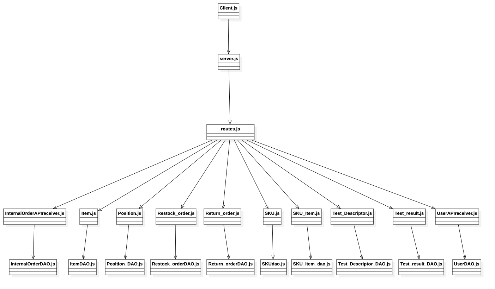
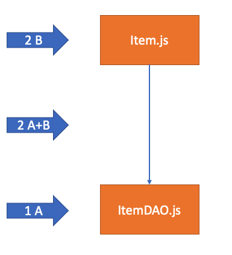

# Integration and API Test Report

Date:

Version:

# Contents

- [Dependency graph](#dependency graph)

- [Integration and API Test Report](#integration-and-api-test-report)
- [Contents](#contents)
- [Dependency graph](#dependency-graph)
- [Integration approach](#integration-approach)
- [Integration Tests](#integration-tests)
  - [Step 1 (A)](#step-1-a)
- [API testing - Scenarios](#api-testing---scenarios)
  - [Scenario UCx.y](#scenario-ucxy)
- [Coverage of Scenarios and FR](#coverage-of-scenarios-and-fr)
- [Coverage of Non Functional Requirements](#coverage-of-non-functional-requirements)
    - 

- [Tests](#tests)

- [Scenarios](#scenarios)

- [Coverage of scenarios and FR](#scenario-coverage)
- [Coverage of non-functional requirements](#nfr-coverage)

# Dependency graph 

     
# Integration approach

    <Write here the integration sequence you adopted, in general terms (top down, bottom up, mixed) and as sequence
    (ex: step1: class A, step 2: class A+B, step 3: class A+B+C, etc)> 
    <Some steps may  correspond to unit testing (ex step1 in ex above), presented in other document UnitTestReport.md>
    <One step will  correspond to API testing>

The integration sequence adopted is bottom-up: 
1)  Starting from DAO classes, we have developed unit testing because no dependencies were present, witouth the use of any driver and interacting directly with the DB. The reason of this choice is that methods of each DAO are supposed to interact with the database only and perform just some minor check and validation on data received: all the major checks are performed on API level. No drivers have been developed because the interaction with the higer level classes is tested further with integration tests.

2.  Once unit test have been done and validated, integration test is performed: receiver classes have been integrated with corresponding DAO classes and tested both.
Also in this case, since the connection with the DB is performed by DAO classes already tested before, no stubs or mock-ups have been used. This step correspond to API testing (A+B).

Ex.

    

#  Integration Tests

   <define below a table for each integration step. For each integration step report the group of classes under test, and the names of
     Jest test cases applied to them, and the mock ups used, if any> Jest test cases should be here code/server/unit_test

## Step 1 (A)
| Classes  | mock up used |Jest test cases |
|--|--|--|
|InternalOrderDAO|| getInternalOrders, createInternalOrder,  modifyInternalOrder, modifyInternalOrder|
|ItemDAO||testStoreItem, testUpdateItem, testGetItemById, testGetSKUIDbyItemID, testGetItembyIdSupp, testGetItems, testDeleteItem|
|Position_DAO||test_get_positions, test_new_position, test_modify_position, test_modify_position_ID, test_delete_position|
|Restock_orderDAO||testGetRestockOrders, testGetRestockOrdersIssued, testGetRestockOrderDeliveredByID, testGetItemList, testCheckItemList, testGetRestockOrderByID, testStoreRestockOrder, testStoreProducts, testUpdateState, testNewSKUItemList, testAddTransportNote, testDeleteRestockOrder|
|Return_orderDAO||testGetReturnOrders, testGetRestockOrderbyID, testGetReturnOrderById, testStoreReturnOrder, testSetReturnItem, testDeleteReturnOrder|
|SKUdao||testGetSKUs,testGetSKUByID, testNewSKU, testModifySKU, testModifySKUPosition, testDeleteSKU|
|SKUItemDao||testNewSKUItem, testGetSKUItems, testGetSKUItemBySKUId, testGetSKUItemByRfid, testModifySKUItem, testDeleteSKUItemByRfid|
|Test_Descriptor_DAO||test_get_test_descriptor, test_new_test_descriptor, test_get_test_descriptor_by_ID, test_modify_test_descriptor, test_delete_test_descriptor|
|Test_result_DAO||test_get_test_result, test_new_test_result, test_get_test_result_with_ID_by_RFID, test_modify_test_result_with_ID_from_RFID, test_delete_test_result_with_id_from_rfid|
|UserDAO||new_user, get_user, get_suppliers, get_users, get_users_sessions, modify_user_type, delete_user, |

# API testing - Scenarios

<If needed, define here additional scenarios for the application. Scenarios should be named
 referring the UC in the OfficialRequirements that they detail>

## Scenario UCx.y

| Scenario |  name |
| ------------- |:-------------:| 
|  Precondition     |  |
|  Post condition     |   |
| Step#        | Description  |
|  1     |  ... |  
|  2     |  ... |

# Coverage of Scenarios and FR

<Report in the following table the coverage of  scenarios (from official requirements and from above) vs FR. 
Report also for each of the scenarios the (one or more) API Mocha tests that cover it. >  Mocha test cases should be here code/server/test

| Scenario ID |      Functional Requirements covered     |                Mocha Test(s)               |
|:-----------:|:----------------------------------------:|:------------------------------------------:|
|     4-1     |               FR1.1, FR1.3               | test UC4-1 - Create user and define rights |
|     4-2     |            FR1.1, FR1.3, FR1.5           |       test UC4-2 - Modify user rights      |
|     4-3     |            FR1.1, FR1.2, FR1.3           |          test UC4-3 - Delete user          |
|     9-1     | FR6.1, FR6.2, FR6.3, FR6.5, FR6.6, FR6.7 |   test UC9-1 - Internal Order IO accepted  |
|     9-2     |               FR6.6, FR6.7               |   test UC9-2 - Internal Order IO refused   |
|     9-3     |               FR6.6, FR6.7               |  test UC9-3 - Internal Order IO cancelled  |
|     10-1    |            FR6.6, FR6.7, FR6.8           |  test UC10-1 - Internal Order IO Completed |
|3-1, 3-2|FR5.1, FR5.2, FR5.3, FR5.5, FR5.6 |testPOSTRestockOrder|
|5-1-1|FR5.2, FR5.3, FR5.5, FR5.7 |testPUTnewSKUItemList|
|5-2-1, 5-2-2, 5-2-3, 5-3-1, 5-3-2, 5-3-3|FR5.3, FR5.5, FR5.7|testPUTRestockOrder|
|6-1, 6-2|FR5.9, FR5.11, |testPOSTReturnOrder|
|11-1|FR7|testPOSTItem|
|11-2|FR7|testPUTItem|
|4.2|FR5.4|getPositions|
|6.2|FR5.7|newTestResult|
|1-1|FR2.1|testNewSKU|
|1-2|FR2.1|testModifySKUPosition|
|1-3|FR2.1|testModifySKU|
||FR2.2|testDeleteSKU|
||FR2.3|testGetSKUs|
||FR2.4|testGetSKUByID|
||FR5.8.3|testNewSKUItem|
||FR6.10|testDeleteSKUItemByRfid|
||FR6.9| testGetSKUItemBySKUId, testGetSKUItemByRfid, testGetSKUItems|

# Coverage of Non Functional Requirements

<Report in the following table the coverage of the Non Functional Requirements of the application - only those that can be tested with automated testing frameworks.>

### 

| Non Functional Requirement | Test name |
| -------------------------- | --------- |
|    NFR5                       |    testing POST /api/skuitem      |

