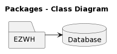
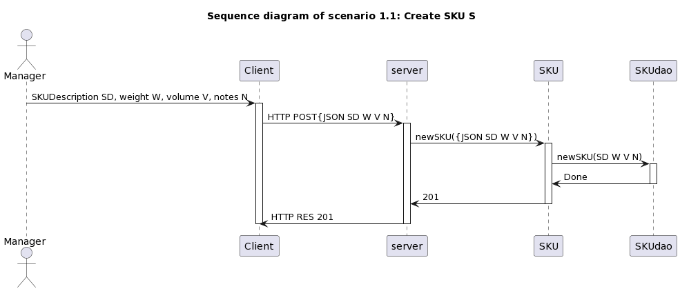
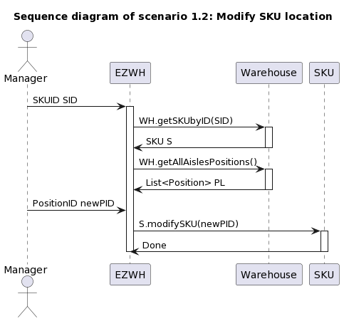
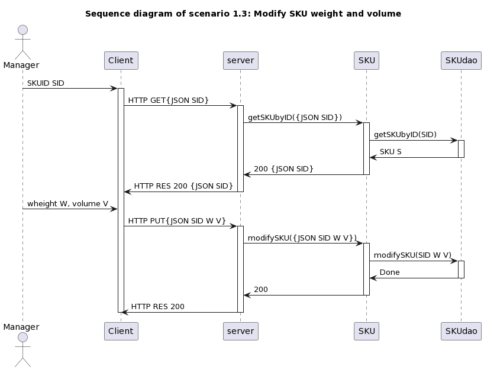
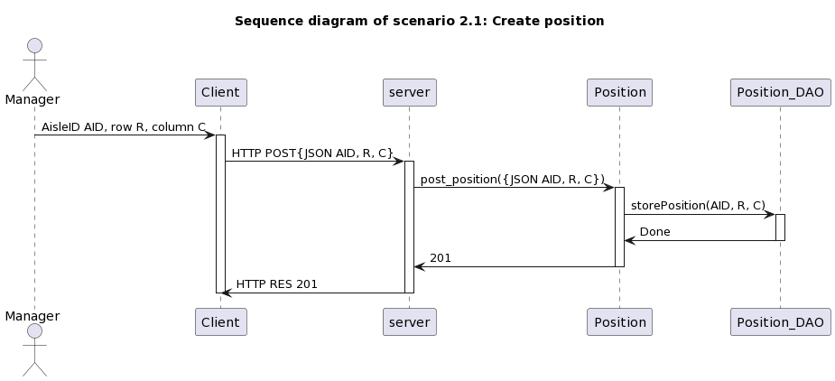
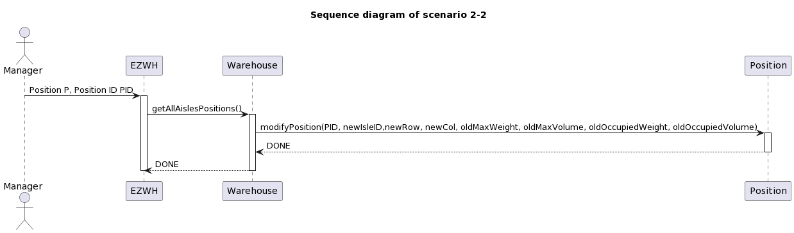
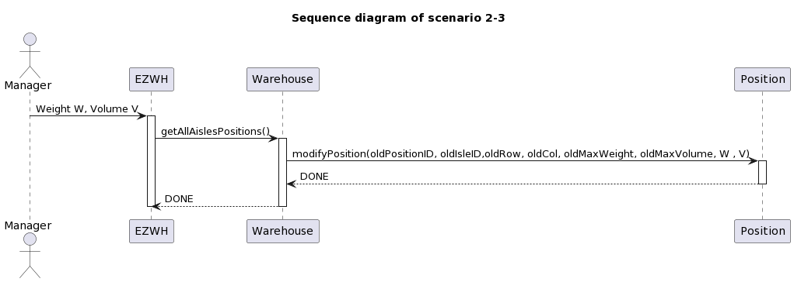
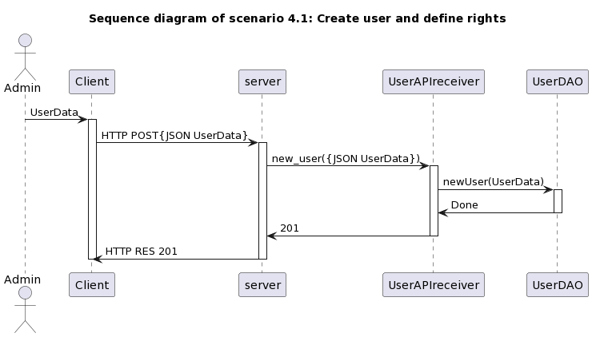

# Design Document 

Authors: Antonello CAPUTO, Daniele DI BATTISTA, Agnese SERAFINO, Diamante Simone CRESCENZO

Date: 22/04/2022

Version: 0.3

| **Version Number** | **Change** |
|--------------------|------------|
| 0.1 | Versioning, High Level Design (Draft), Verification Matrix (first implementation) |
| 0.2 | Sequence Diagrams for Scenario 1-2 and 1-3 |
| 0.3 | Sequence Diagrams corrections for Scenario 1-2 and 1-3, changed images paths. Added Sequence Diagrams for Scenario 1-1, 2-1, 2-2, 2-3, 4-1 |
|  |  |

# Contents

- [High level design](#package-diagram)
- [Low level design](#class-diagram)
- [Verification traceability matrix](#verification-traceability-matrix)
- [Verification sequence diagrams](#verification-sequence-diagrams)

# Instructions

The design must satisfy the Official Requirements document, notably functional and non functional requirements, and be consistent with the APIs

# High level design 

<discuss architectural styles used, if any>
<report package diagram, if needed>

We are using **Client** **server** architectural pattern, having a set of stand-alone servers that provides specific services and a set of clients that call these services.

In client-server architecture, data processing is distributed among all the components: it is a distributed system model that requires network capabilities to allow clients to access servers.

Using client-server has a lot of **advantages**
- data are well distributed  
- requires cheaper hardware to develop servers
- servers management is easy compared to mainframes
- management is replicated in each server 

Disadvantages are 
- datamodel is free and every server can choose its own: in our scenario we have just one single server, so we have an unique data model
- rendundant management policies in each server: also in this case is not a problem because we are planning to use just or at leas few servers 

EZWH is a client server application composed of one executable generating one single process and thread that communicates with data stored inside a database.

# Low level design

<for each package in high level design, report class diagram. Each class should detail attributes and operations>

# Verification traceability matrix

\<for each functional requirement from the requirement document, list which classes concur to implement it>

|         |                      Warehouse                      | User | InternalOrder | Aisle | SKUItem | Position | SKU | Item | Supplier | Order | TestResult | TestDescriptor |
|---------|:---------------------------------------------------:|:----:|:-------------:|:-----:|:-------:|:--------:|:---:|:----:|:--------:|:-----:|:----------:|:--------------:|
| FR1     |                          X                          |   X  |               |       |         |          |     |      |          |       |            |                |
| FR1.1   |                          X                          |   X  |               |       |         |          |     |      |          |       |            |                |
| FR1.2   |                          X                          |      |               |       |         |          |     |      |          |       |            |                |
| FR1.3   |                          X                          |      |               |       |         |          |     |      |          |       |            |                |
| FR1.4   |                          X                          |      |               |       |         |          |     |      |          |       |            |                |
| FR1.5   |                          X                          |      |               |       |         |          |     |      |          |       |            |                |
| FR2     |                          X                          |      |               |       |         |          |  X  |      |          |       |            |                |
| FR2.1   |                          X                          |      |               |       |         |          |  X  |      |          |       |            |                |
| FR2.2   |                          X                          |      |               |       |         |          |     |      |          |       |            |                |
| FR2.3   |                          X                          |      |               |       |         |          |     |      |          |       |            |                |
| FR2.4   |          X (add search SKU by description)          |      |               |       |         |          |     |      |          |       |            |                |
| FR3     |                          X                          |      |               |       |         |          |     |      |          |       |            |                |
| FR3.1   |                          X                          |      |               |   X   |         |     X    |     |      |          |       |            |                |
| FR3.1.1 |                          X                          |      |               |   X   |         |     X    |     |      |          |       |            |                |
| FR3.1.2 |                          X                          |      |               |       |         |          |     |      |          |       |            |                |
| FR3.1.3 |                          X                          |      |               |       |         |          |     |      |          |       |            |                |
| FR3.1.4 |                          X                          |      |               |   X   |         |     X    |     |      |          |       |            |                |
| FR3.2   |                          X                          |      |               |       |    X    |          |  X  |      |          |       |      X     |        X       |
| FR3.2.1 |              (missing ADD quality test)             |      |               |       |         |          |     |      |          |       |            |                |
| FR3.2.2 |            (missing MODIFY quality test)            |      |               |       |         |          |     |      |          |       |            |                |
| FR3.2.3 |            (missing DELETE quality test)            |      |               |       |         |          |     |      |          |       |            |                |
| FR4     |             X (All 4.x are not specific)            |   X  |               |       |         |          |     |      |          |       |            |                |
| FR4.1   |                          X                          |   X  |               |       |         |          |     |      |          |       |            |                |
| FR4.2   |                          X                          |      |               |       |         |          |     |      |          |       |            |                |
| FR4.3   |                          X                          |      |               |       |         |          |     |      |          |       |            |                |
| FR4.4   |                          X                          |      |               |       |         |          |     |      |          |       |            |                |
| FR5     |                          X                          |      |               |   X   |    X    |     X    |  X  |   X  |     X    |   X   |            |                |
| FR5.1   |                          X                          |      |               |       |         |          |     |      |          |   X   |            |                |
| FR5.2   |                          X                          |      |               |       |         |          |  X  |      |          |   X   |            |                |
| FR5.3   |       (missing REMOVE SKU from restock order)       |      |               |       |         |          |     |      |          |       |            |                |
| FR5.4   |                          X                          |      |               |       |         |          |     |      |          |   X   |            |                |
| FR5.5   |                          X                          |      |               |       |         |          |     |      |     X    |   X   |            |                |
| FR5.6   |                          X                          |      |               |       |         |          |     |      |          |   X   |            |                |
| FR5.7   |         (missing MODIFY restock order state)        |      |               |       |         |          |     |      |          |       |            |                |
| FR5.8   |                          X                          |      |               |   X   |    X    |     X    |     |      |          |   X   |            |                |
| FR5.8.1 |     X (RFID should be created and not received)     |      |               |       |    X    |          |     |      |          |       |            |                |
| FR5.8.2 |                          X                          |      |               |       |         |          |     |      |          |       |      X     |        X       |
| FR5.8.3 |  X (missing some storage parameters e.g. position)  |      |               |       |         |          |     |      |          |       |            |                |
| FR5.9   |                          X                          |      |               |       |         |          |     |      |          |   X   |            |                |
| FR5.10  |        (missing ADD SKU item to return order)       |      |               |       |         |          |     |      |          |       |            |                |
| FR5.11  |                          X                          |      |               |       |         |          |     |      |          |   X   |            |                |
| FR5.12  |         (missing MODIFY return order state)         |      |               |       |         |          |     |      |          |       |            |                |
| FR6     |                          X                          |      |       X       |       |         |          |     |      |          |       |            |                |
| FR6.1   |                          X                          |      |       X       |       |         |          |     |      |          |       |            |                |
| FR6.2   |         (missing ADD SKU to internal order)         |      |               |       |         |          |     |      |          |       |            |                |
| FR6.3   |                          X                          |      |               |       |         |          |     |      |          |       |            |                |
| FR6.4   |       (missing DELETE SKU from internal order)      |      |               |       |         |          |     |      |          |       |            |                |
| FR6.5   |                          X                          |      |       X       |       |         |          |     |      |          |       |            |                |
| FR6.6   | (missing ACCEPT, REJECT (or CANCEL) internal order) |      |               |       |         |          |     |      |          |       |            |                |
| FR6.7   |                          X                          |      |       X       |       |         |          |     |      |          |       |            |                |
| FR6.8   |     (missing MANAGE DELIVERY of internal order)     |      |               |       |         |          |     |      |          |       |            |                |
| FR6.9   |           (not sure if FIFO is considered)          |      |               |       |         |          |     |      |          |       |            |                |
| FR6.10  |                          X                          |      |               |       |         |          |     |      |          |       |            |                |
| FR7     |                          X                          |      |               |       |         |          |     |   X  |          |       |            |                |

# Verification sequence diagrams 
\<select key scenarios from the requirement document. For each of them define a sequence diagram showing that the scenario can be implemented by the classes and methods in the design>

## Sequence diagram of Scenario 1.1 (Scenario ID: Scenario 1-1)

## Sequence diagram of Scenario 1.2 (Scenario ID: Scenario 1-2)

## Sequence diagram of Scenario 1.3 (Scenario ID: Scenario 1-3)

## Sequence diagram of Scenario 2.1 (Scenario ID: Scenario 2-1)

## Sequence diagram of Scenario 2.2 (Scenario ID: Scenario 2-2)

## Sequence diagram of Scenario 2.3 (Scenario ID: Scenario 2-3)

## Sequence diagram of Scenario 4.1 (Scenario ID: Scenario 4-1)

