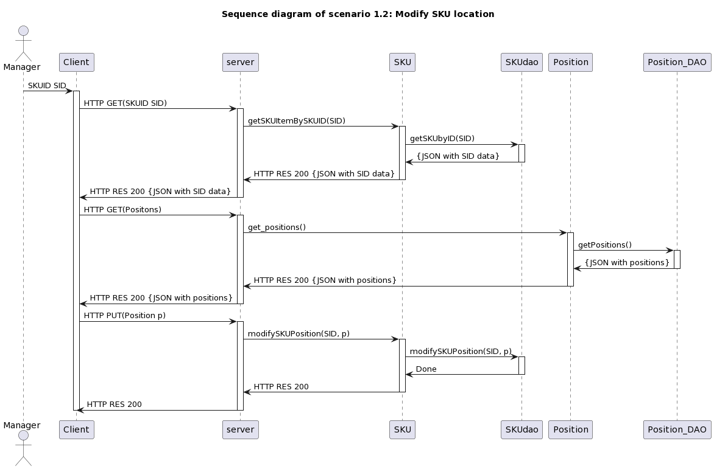
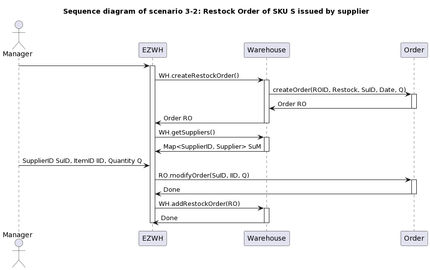
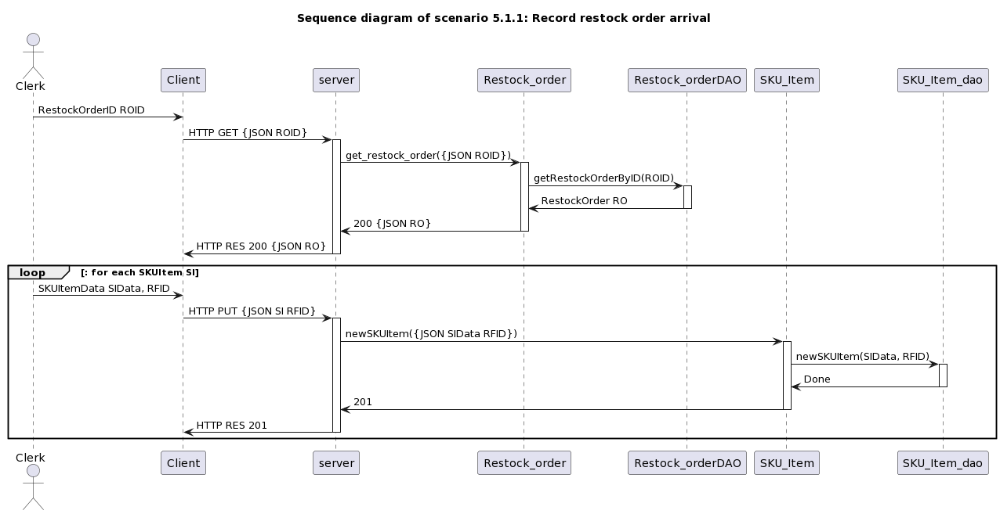
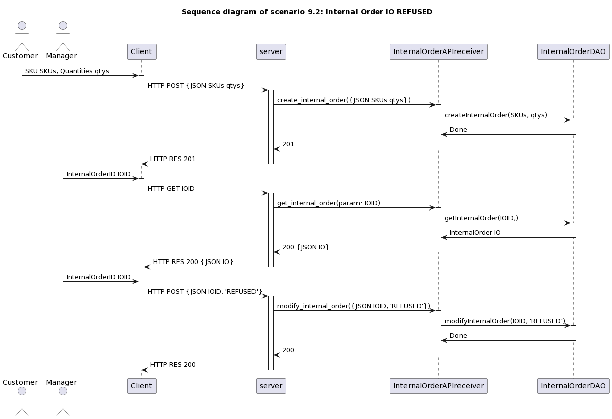
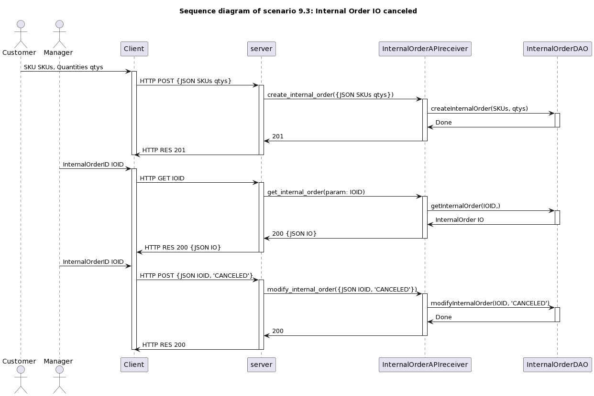
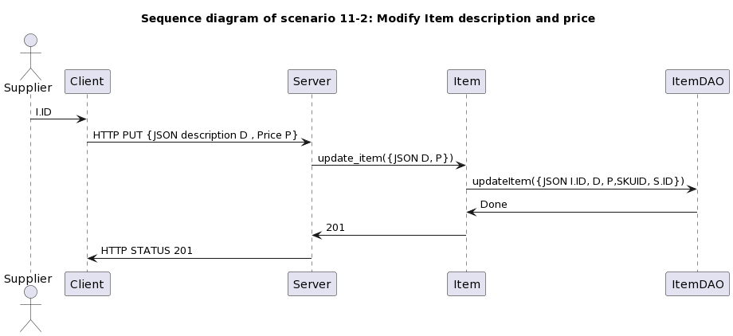

# Design Document 

Authors: Antonello CAPUTO, Daniele DI BATTISTA, Agnese SERAFINO, Diamante Simone CRESCENZO

Date: 26/04/2022

Version: 1.2

| **Version Number** | **Change** |
|--------------------|------------|
| 0.1 | Versioning, High Level Design (Draft), Verification Matrix (first implementation) |
| 0.2 | Sequence Diagrams for Scenario 1-2 and 1-3 |
| 0.3 | Sequence Diagrams corrections for Scenario 1-2 and 1-3, changed images paths. Added Sequence Diagrams for Scenario 1-1, 2-1, 2-2, 2-3, 4-1 |
| 0.4 | Sequence Diagrams for Scenario 2-4, 2-5, 3-1, and 3-2 |
| 0.5 | Corrections on Verification traceability matrix |
| 0.6 | Sequence Diagrams for Scenario 5-1-1 and 5-2-1 |
| 0.7 | Sequence Diagrams for Scenario 5-3-1 and 5-3-2 |
| 1.0 | Class Diagram and Package Diagram (First complete version)  |
| 1.1 | Sequence Diagrams for Scenario 6-1, 7-1, 7-2, 11-1 and 11-2. Cleaned guidelines. |
| 1.2 | Sequence Diagrams for Scenario 9-1, 12-1, 12-2 and 12-3. |

# Contents

- [High level design](#package-diagram)
- [Low level design](#class-diagram)
- [Verification traceability matrix](#verification-traceability-matrix)
- [Verification sequence diagrams](#verification-sequence-diagrams)

# Instructions

The design must satisfy the Official Requirements document, notably functional and non functional requirements, and be consistent with the APIs

# High level design 

We are using **Client** **server** architectural pattern, having a set of stand-alone servers that provides specific services and a set of clients that call these services.

In client-server architecture, data processing is distributed among all the components: it is a distributed system model that requires network capabilities to allow clients to access servers.

Using client-server has a lot of **advantages**
- data are well distributed  
- requires cheaper hardware to develop servers
- servers management is easy compared to mainframes
- management is replicated in each server 

Disadvantages are 
- datamodel is free and every server can choose its own: in our scenario we have just one single server, so we have an unique data model
- rendundant management policies in each server: also in this case is not a problem because we are planning to use just or at leas few servers 

EZWH is a client server application composed of one executable generating one single process and thread that communicates with data stored inside a database.

# Low level design

# Verification traceability matrix

|         | Warehouse | User | InternalOrder | Aisle | SKUItem | Position | SKU | Item | Supplier | Order | TestResult | TestDescriptor |
|---------|:---------:|:----:|:-------------:|:-----:|:-------:|:--------:|:---:|:----:|:--------:|:-----:|:----------:|:--------------:|
| FR1     |     X     |   X  |               |       |         |          |     |      |          |       |            |                |
| FR1.1   |     X     |   X  |               |       |         |          |     |      |          |       |            |                |
| FR1.2   |     X     |   X  |               |       |         |          |     |      |          |       |            |                |
| FR1.3   |     X     |   X  |               |       |         |          |     |      |          |       |            |                |
| FR1.4   |     X     |   X  |               |       |         |          |     |      |          |       |            |                |
| FR1.5   |     X     |   X  |               |       |         |          |     |      |          |       |            |                |
| FR2     |     X     |      |               |       |         |          |  X  |      |          |       |            |                |
| FR2.1   |     X     |      |               |       |         |          |  X  |      |          |       |            |                |
| FR2.2   |     X     |      |               |       |         |          |     |      |          |       |            |                |
| FR2.3   |     X     |      |               |       |         |          |     |      |          |       |            |                |
| FR2.4   |     X     |      |               |       |         |          |  X  |      |          |       |            |                |
| FR3     |     X     |      |               |       |         |          |     |      |          |       |            |                |
| FR3.1   |     X     |      |               |   X   |         |     X    |     |      |          |       |            |                |
| FR3.1.1 |     X     |      |               |   X   |         |     X    |     |      |          |       |            |                |
| FR3.1.2 |     X     |      |               |       |         |          |     |      |          |       |            |                |
| FR3.1.3 |     X     |      |               |       |         |          |     |      |          |       |            |                |
| FR3.1.4 |     X     |      |               |   X   |         |     X    |     |      |          |       |            |                |
| FR3.2   |     X     |      |               |       |         |          |     |      |          |       |      X     |        X       |
| FR3.2.1 |     X     |      |               |       |         |          |     |      |          |       |      X     |                |
| FR3.2.2 |     X     |      |               |       |         |          |     |      |          |       |      X     |                |
| FR3.2.3 |     X     |      |               |       |         |          |     |      |          |       |      X     |                |
| FR4     |     X     |   X  |               |       |         |          |     |      |          |       |            |                |
| FR4.1   |     X     |   X  |               |       |         |          |     |      |          |       |            |                |
| FR4.2   |     X     |      |               |       |         |          |     |      |          |       |            |                |
| FR4.3   |     X     |      |               |       |         |          |     |      |          |       |            |                |
| FR4.4   |     X     |      |               |       |         |          |     |      |          |       |            |                |
| FR5     |     X     |      |               |   X   |    X    |     X    |  X  |   X  |     X    |   X   |            |                |
| FR5.1   |     X     |      |               |       |         |          |     |      |          |   X   |            |                |
| FR5.2   |     X     |      |               |       |         |          |  X  |      |          |   X   |            |                |
| FR5.3   |     X     |      |               |       |         |          |  X  |      |          |   X   |            |                |
| FR5.4   |     X     |      |               |       |         |          |     |      |          |   X   |            |                |
| FR5.5   |     X     |      |               |       |         |          |     |      |     X    |   X   |            |                |
| FR5.6   |     X     |      |               |       |         |          |     |      |          |   X   |            |                |
| FR5.7   |     X     |      |               |       |         |          |     |      |          |   X   |            |                |
| FR5.8   |     X     |      |               |   X   |    X    |     X    |     |      |          |   X   |            |                |
| FR5.8.1 |     X     |      |               |       |    X    |          |     |      |          |       |            |                |
| FR5.8.2 |     X     |      |               |       |         |          |     |      |          |       |      X     |        X       |
| FR5.8.3 |     X     |      |               |       |         |          |     |      |          |       |            |                |
| FR5.9   |     X     |      |               |       |         |          |     |      |          |   X   |            |                |
| FR5.10  |     X     |      |               |       |         |          |  X  |      |          |   X   |            |                |
| FR5.11  |     X     |      |               |       |         |          |     |      |          |   X   |            |                |
| FR5.12  |     X     |      |               |       |         |          |     |      |          |   X   |            |                |
| FR6     |     X     |      |       X       |       |         |          |     |      |          |       |            |                |
| FR6.1   |     X     |      |       X       |       |         |          |     |      |          |       |            |                |
| FR6.2   |     X     |      |               |       |         |          |  X  |      |          |   X   |            |                |
| FR6.3   |     X     |      |               |       |         |          |     |      |          |       |            |                |
| FR6.4   |     X     |      |               |       |         |          |  X  |      |          |   X   |            |                |
| FR6.5   |     X     |      |       X       |       |         |          |     |      |          |       |            |                |
| FR6.6   |     X     |      |               |       |         |          |     |      |          |   X   |            |                |
| FR6.7   |     X     |      |       X       |       |         |          |     |      |          |       |            |                |
| FR6.8   |     X     |      |               |       |         |          |     |      |          |   X   |            |                |
| FR6.9   |           |      |               |       |         |     X    |     |      |          |       |            |                |
| FR6.10  |     X     |      |               |       |         |          |     |      |          |       |            |                |
| FR7     |     X     |      |               |       |         |          |     |   X  |          |       |            |                |

# Verification sequence diagrams 

## Sequence diagram of Scenario 1.1 (Scenario ID: Scenario 1-1)

## Sequence diagram of Scenario 1.2 (Scenario ID: Scenario 1-2)

## Sequence diagram of Scenario 1.3 (Scenario ID: Scenario 1-3)

## Sequence diagram of Scenario 2.1 (Scenario ID: Scenario 2-1)

## Sequence diagram of Scenario 2.2 (Scenario ID: Scenario 2-2)

## Sequence diagram of Scenario 2.3 (Scenario ID: Scenario 2-3)

## Sequence diagram of Scenario 2.4 (Scenario ID: Scenario 2-4)

## Sequence diagram of Scenario 2.5 (Scenario ID: Scenario 2-5)

## Sequence diagram of Scenario 3.1 (Scenario ID: Scenario 3-1)

## Sequence diagram of Scenario 3.2 (Scenario ID: Scenario 3-2)

## Sequence diagram of Scenario 4.1 (Scenario ID: Scenario 4-1)

## Sequence diagram of Scenario 5.1.1 (Scenario ID: Scenario 5-1-1)

## Sequence diagram of Scenario 5.2.1 (Scenario ID: Scenario 5-2-1)

## Sequence diagram of Scenario 5.3.1 (Scenario ID: Scenario 5-3-1)

## Sequence diagram of Scenario 5.3.2 (Scenario ID: Scenario 5-3-2)

## Sequence diagram of Scenario 6.1 (Scenario ID: Scenario 6-1)

## Sequence diagram of Scenario 7.1 (Scenario ID: Scenario 7-1)

## Sequence diagram of Scenario 7.2 (Scenario ID: Scenario 7-2)

## Sequence diagram of Scenario 9.1 (Scenario ID: Scenario 9-1)

## Sequence diagram of Scenario 9.2 (Scenario ID: Scenario 9-2)

## Sequence diagram of Scenario 9.3 (Scenario ID: Scenario 9-3)

## Sequence diagram of Scenario 11.1 (Scenario ID: Scenario 11-1)

## Sequence diagram of Scenario 11.2 (Scenario ID: Scenario 11-2)

## Sequence diagram of Scenario 12.1 (Scenario ID: Scenario 12-1)

## Sequence diagram of Scenario 12.2 (Scenario ID: Scenario 12-2)

## Sequence diagram of Scenario 12.3 (Scenario ID: Scenario 12-3)

