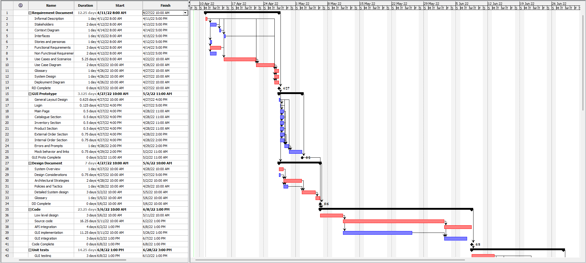
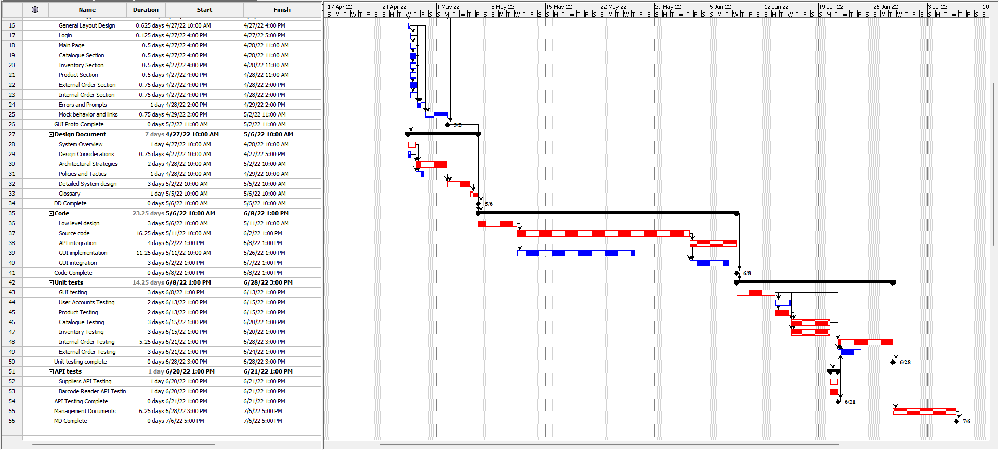

# Project Estimation  
Date: 10 april 2022

Version: 1.1

# Estimation approach
Consider the EZWH  project as described in YOUR requirement document, assume that you are going to develop the project INDEPENDENT of the deadlines of the course
# Estimate by size
|             | Estimate    |             
| ----------- | :-------------------------------: |  
| NC =  Estimated number of classes to be developed  | 25                                 |             
|  A = Estimated average size per class, in LOC       |          300 - 400                  | 
| S = Estimated size of project, in LOC (= NC * A) | 7500 - 10000 | 
| E = Estimated effort, in person hours (here use productivity 10 LOC per person hour)  |                      750ph - 1000               |   
| C = Estimated cost, in euro (here use 1 person hour cost = 30 euro) |  22.500 euro - 30.000 euro | 
| Estimated calendar time, in calendar weeks (Assume team of 4 people, 8 hours per day, 5 days per week ) |       750 ph /(4\*8\*5)= 4,69 weeks - 1000 ph /(4\*8\*5)= 6,25 weeks  |               

# Estimate by product decomposition
| Component name    | Estimated effort (person hours)   |             
| ----------- | :-------------------------------: | 
| Requirement Document | 100 |
| GUI Prototype | 50 |
| Design Document | 75 |
| Code | 350 |
| Unit Tests | 150 |
| API Tests | 20 |
| Management Documents  | 50 |
| **Total** | 795 |

# Estimate by activity decomposition
|         Activity name    | Estimated effort (person hours)   |             
| ----------- | :-------------------------------: | 
| **Requirement Document** | Total: 170 |
| Informal Description | 8 |
| Stakeholders | 16 |
| Context Diagram | 8 |
| Interfaces | 8 |
| Stories and personas | 8 |
| Functional Requirements | 24 |
| Non Functinoal Requirements | 16 |
| Use Cases and Scenarios | 42 |
| Use Case Diagram | 16 |
| Glossary | 8 |
| System Design | 8 |
| Deployment Diagram | 8 |
| **GUI Prototype** | Total: 48 |
| General Layout Design | 5 |
| Login | 1 |
| Main Page | 4 |
| Catalogue Section | 4 |
| Inventory Section | 4 |
| Product Section | 4 |
| External Order Section | 6 |
| Internal Order Section | 6 |
| Errors and Prompts | 8 |
| Mock behavior and links | 6 |
| **Design Document** | Total: 70 |
| System Overview | 8 |
| Design Considerations | 6 |
| Architectural Strategies | 16 |
| Policies and Tactics | 8 |
| Detailed System design | 24 |
| Glossary | 8 |
| **Code** | Total: 300 |
| Low level design | 24 |
| Source code | 130 |
| API integration | 32 |
| GUI implementation | 90 |
| GUI integration | 24 |
| **Unit tests** | Total: 170 |
| GUI testing | 24 |
| User Accounts Testing | 16 |
| Product Testing | 16 |
| Catalogue Testing | 24 |
| Inventory Testing | 24  |
| Internal Order Testing | 42 |
| External Order Testing | 24 |
| **API tests** | Total: 16 |
| Suppliers API Testing | 8 |
| Barcode Reader API Testing | 8 |
| **Management Documents** | Total: 50 |
| **Total** | 924 |
|  |  |

## Gantt chart

# Summary

|             | Estimated effort                        |   Estimated duration |          
| ----------- | ------------------------------- | ---------------|
| Estimate by Size | 750 ph | 4.69 working weeks (23.4 working days) |
| Estimate by Product decomposition | 795 ph | 4.97 ww (24.8 wd) |
| Estimate by Activity decomposition | 924 ph | 5.78 ww (28.9 wd) |

The estimate by size shows a lower value, this is due to the very low detail level given by a Line Of Code approximation.
When a decomposition procecedure is applied to the design estimate, an increasing trend in the forecasted effort is shown. Moreover, it is interesting to notice that, given the same categories, the Activity and Product decomposition show different total efforts. This is probably due to an overestimation (or underestimation repspectively) when a certain detail level is stil hidden. The largest forecasted effort is shown by Activity decomposition, in which each activity estimate has been tought by means of a close relation with a real working day (8 hours).

