# Graphical User Interface Prototype  

Authors:

Date:

Version:

\<Report here the GUI that you propose. You are free to organize it as you prefer. A suggested presentation matches the Use cases and scenarios defined in the Requirement document. The GUI can be shown as a sequence of graphical files (jpg, png)  >

##Use case 2: authentication

#Scenario 2.1: Login
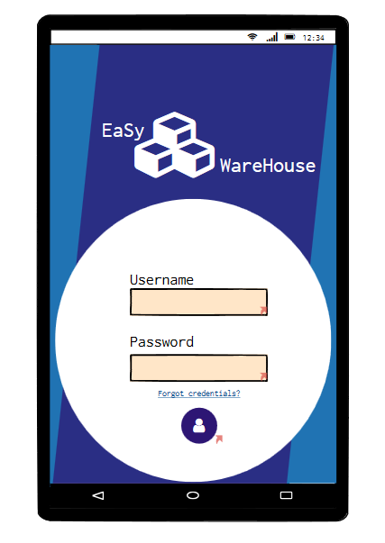
Error message in case of incompelte login:
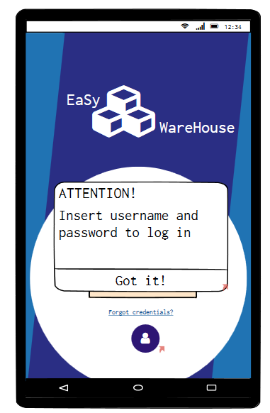
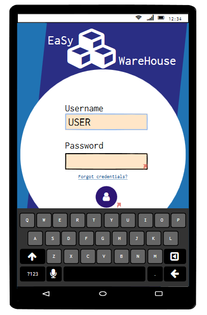
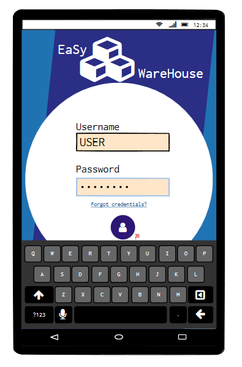

#Scenario 2.2: Login with errors
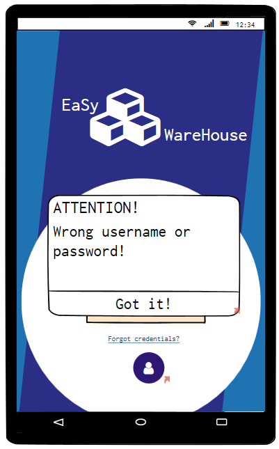

#Scenario 2.4: Credentials Recovery
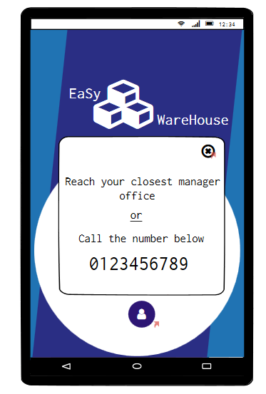

#Scenario 2.3: Logout
This scenario is implemented in three different pages: the main page of the warehouse manager, of the warehouse worker and of the organizational unit employee. These images also represent the main pages for both actors, they can be distinguished by the color and content of the top bar.
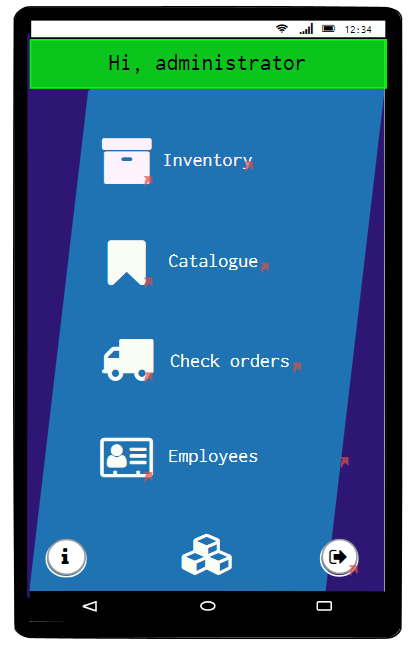
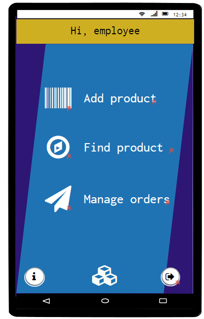
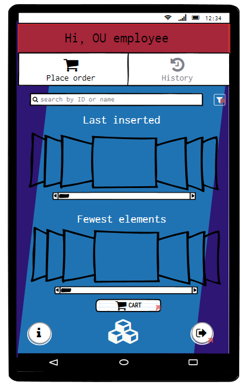

#Use case 4: manage inventory 

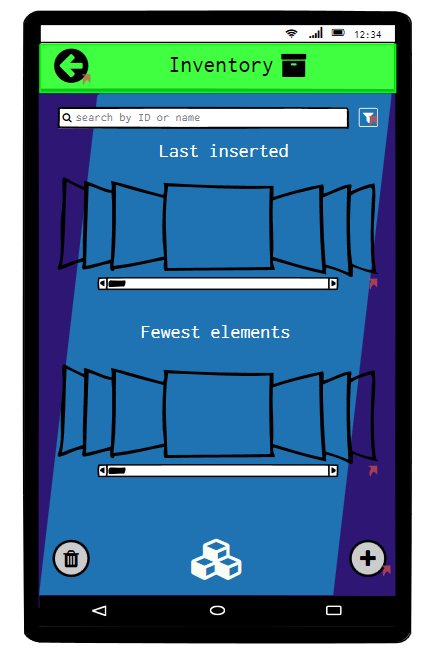

#Scenario 4.1 and 4.2: Create and insert Product in Inventory
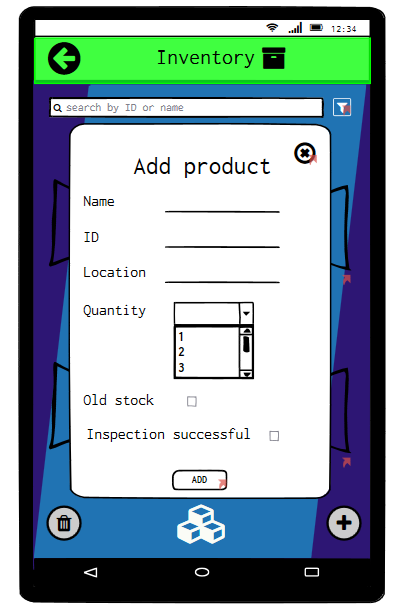
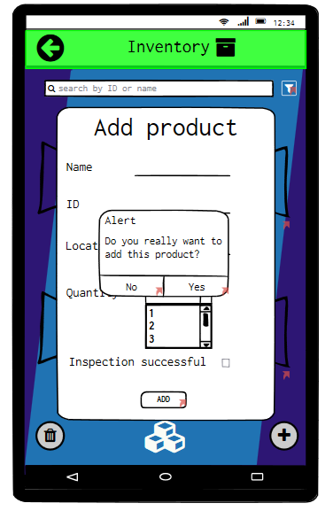
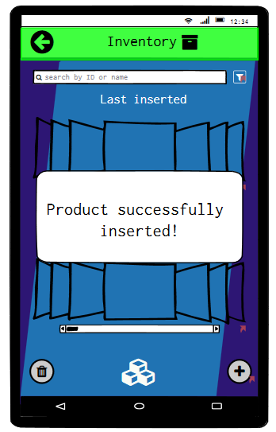

#Scenario 4.3: Modify product quantity in Inventory
To find a product in the list one can use the filter results option. By clicking on the product slot it is possible to see the product info and then, by clicking on the circle button on the bottom right side, one can modify it.
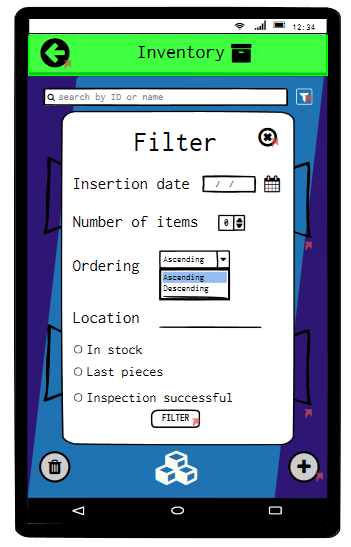
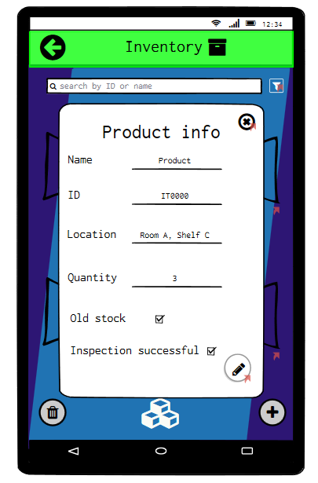
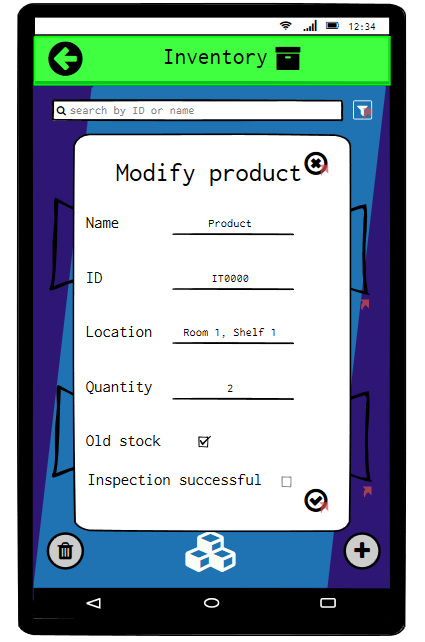

#Scenario 4.4: remove product from inventory
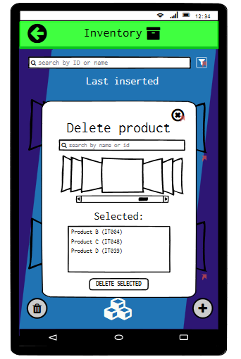

#Scenario 4.5: Track product in inventory
This function is implemented in the WH worker page.
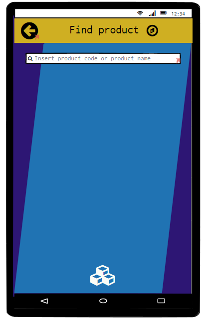
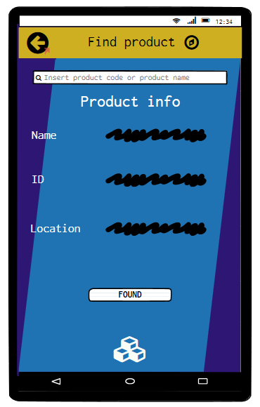

