# Graphical User Interface Prototype  

Authors:

Date:

Version:

# Use case 1: Manage user account

## Scenario 1.5: WH workers list and retrieve information
The WH manager can check the list of WH workers and their specific job:  

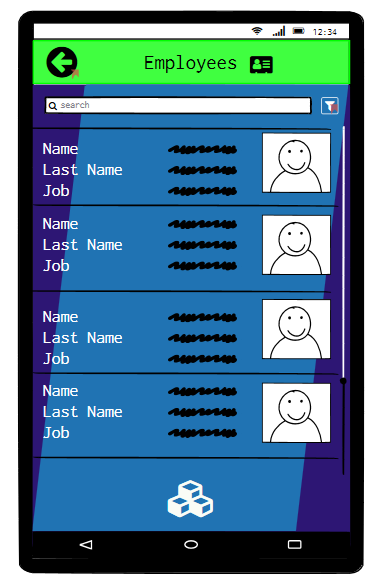

# Use case 2: Authentication

## Scenario 2.1: Login

  
Error message in case of incomplete login:  

  

## Scenario 2.2: Login with errors

## Scenario 2.4: Credentials Recovery

## Scenario 2.3: Logout

This scenario is implemented in three different pages: the main page of the warehouse manager, of the warehouse worker and of the organizational unit employee. These images also represent the main pages for both actors, they can be distinguished by the color and content of the top bar.

# Use case 4: Manage inventory 

## Scenario 4.1 and 4.2: Create and insert Product in Inventory

## Scenario 4.3: Modify product quantity in Inventory

To find a product in the list one can use the filter results option. By clicking on the product slot it is possible to see the product info and then, by clicking on the circle button on the bottom right side, one can modify it.

## Scenario 4.4: Remove product from inventory

## Scenario 4.5: Track product in inventory

This function is implemented in the WH worker page.

# Use case 3: Manage catalogue

## Scenario 3.1 and 3.2: Create catalogue and add new product

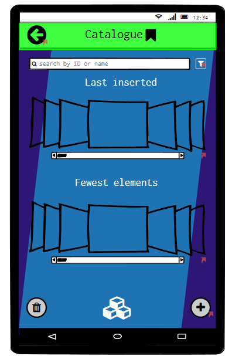
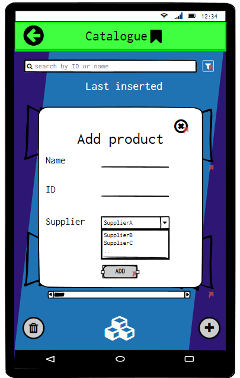

## Scenario 3.3: Modify product in catalogue

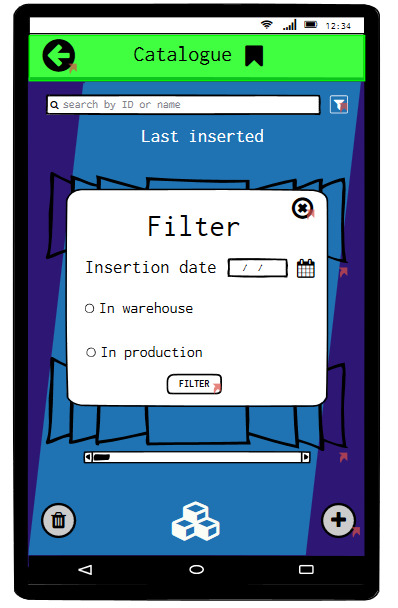
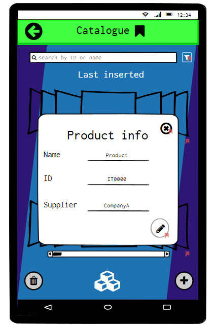
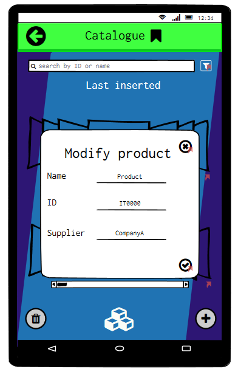

## Scenario 3.4: Remove product from catalogue

# Use case 6: External Orders stock and management

## Scenario 6.1: WH Worker stocks products

WH worker stocks products by scanning the barcode:  

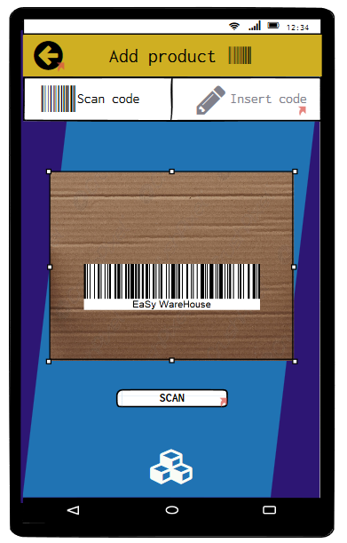
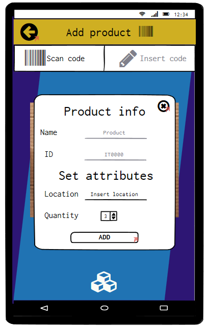
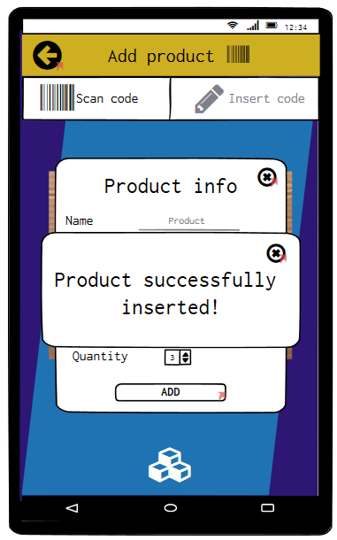  

WH worker stocks products by inserting the product code:  

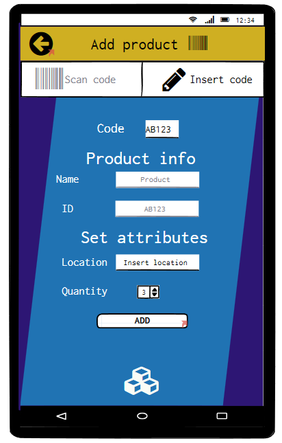
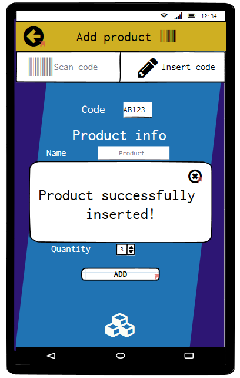

# Use case 7: Internal order issue

## Scenario 7.1: OU issues internal order

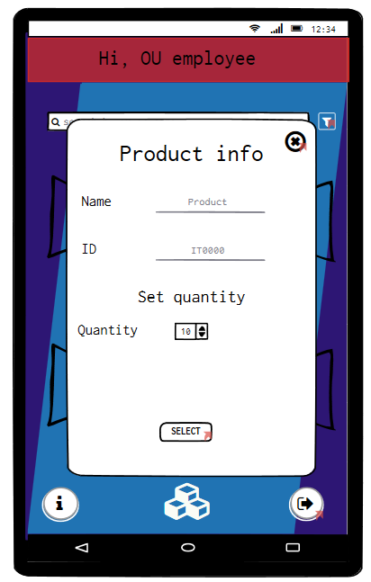

## Scenario 7.2: OU checks Internal Order status

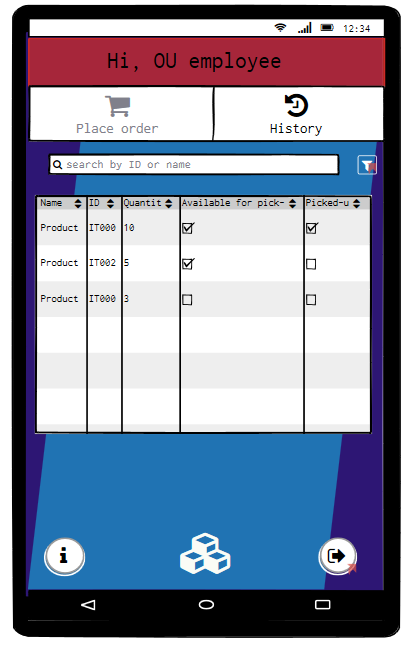

# Use case 8:Internal order stock and management

## Scenario 8.1: WH Worker Prepares Order

When the order is received, the WH manager needs to accept it first:

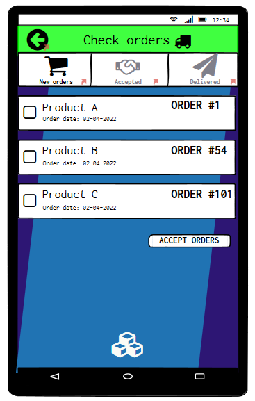  

Then, the WH worker or manager can send it to be delivered, but the WH worker can also see the location of the product by tapping on its name:  
WH manager:  

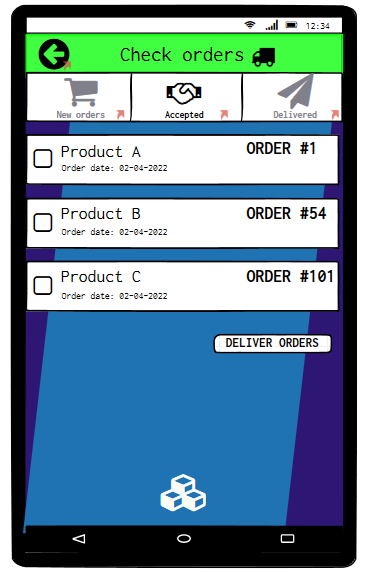  

WH worker:  

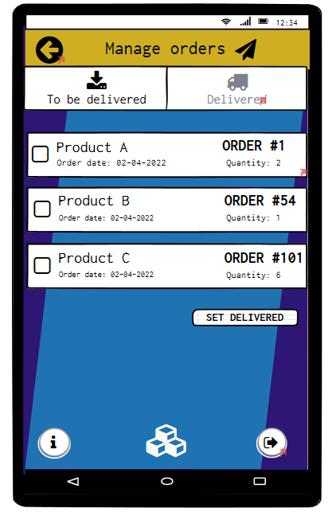

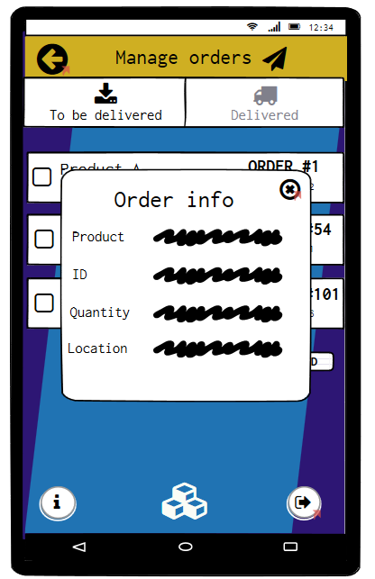

## Scenario 8.2: Internal Order Ready

As in the last scenario, both the WH worker and manager can see the delivered products:  
WH manager:  
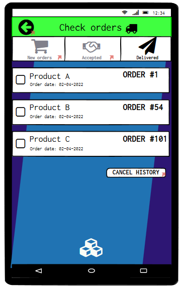  
WH worker:  
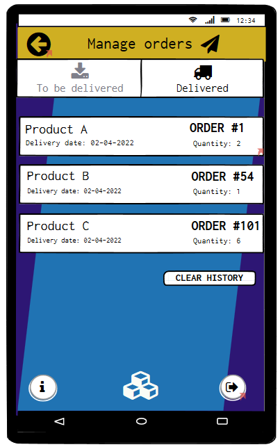  

