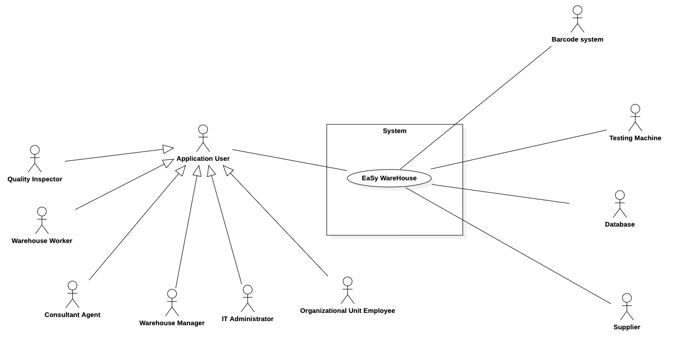
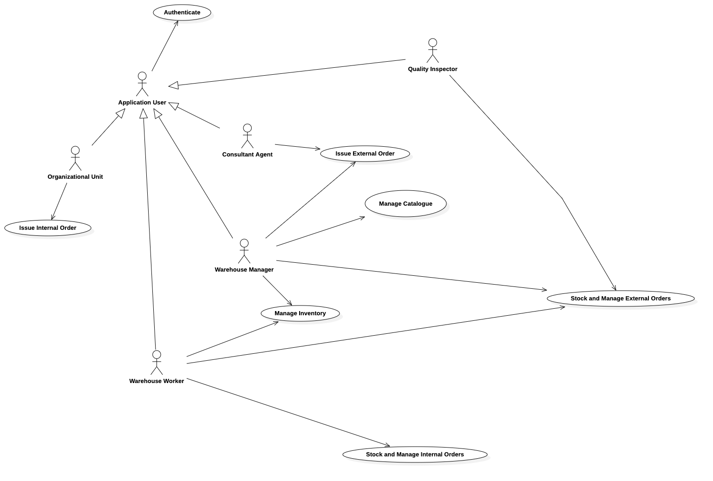
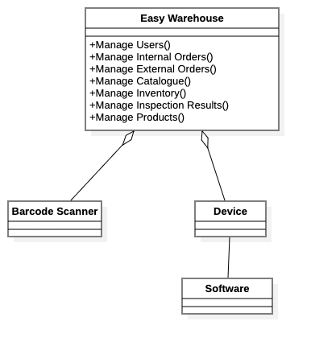

 #Requirements Document 

Date: 22 march 2022

Version: 0.0

 
| Version number | Change |
| ----------------- |:-----------|
| | | 

# Contents

- [Informal description](#informal-description)
- [Stakeholders](#stakeholders)
- [Context Diagram and interfaces](#context-diagram-and-interfaces)
	+ [Context Diagram](#context-diagram)
	+ [Interfaces](#interfaces) 
	
- [Stories and personas](#stories-and-personas)
- [Functional and non functional requirements](#functional-and-non-functional-requirements)
	+ [Functional Requirements](#functional-requirements)
	+ [Non functional requirements](#non-functional-requirements)
- [Use case diagram and use cases](#use-case-diagram-and-use-cases)
	+ [Use case diagram](#use-case-diagram)
	+ [Use cases](#use-cases)
    	+ [Relevant scenarios](#relevant-scenarios)
- [Glossary](#glossary)
- [System design](#system-design)
- [Deployment diagram](#deployment-diagram)

# Informal description
Medium companies and retailers need a simple application to manage the relationship with suppliers and the inventory of physical items stocked in a physical warehouse. 
The warehouse is supervised by a manager, who supervises the availability of items. When a certain item is in short supply, the manager issues an order to a supplier. In general the same item can be purchased by many suppliers. The warehouse keeps a list of possible suppliers per item. 

After some time the items ordered to a supplier are received. The items must be quality checked and stored in specific positions in the warehouse. The quality check is performed by specific roles (quality office), who apply specific tests for item (different items are tested differently). Possibly the tests are not made at all, or made randomly on some of the items received. If an item does not pass a quality test it may be rejected and sent back to the supplier. 

Storage of items in the warehouse must take into account the availability of physical space in the warehouse. Further the position of items must be traced to guide later recollection of them.

The warehouse is part of a company. Other organizational units (OU) of the company may ask for items in the warehouse. This is implemented via Internal Orders, received by the warehouse. Upon reception of an Internal Order the warehouse must collect the requested item(s), prepare them and deliver them to a pick up area. When the item is collected by the other OU the Internal Order is completed. 

EZWH (EaSy WareHouse) is a software application to support the management of a warehouse.

# Stakeholders

| Stakeholder name  | Description | 
| ----------------- |:-----------:|
| Supplier | External entity in charge of supply Products ordered by a Warehouse |
| Company | Entity that has to follow normal accepted business practices and operates in order to make a profit |
| Organizational Unit (OU) | Sub-unit of a Company with a specific action domain |
| IT Administrator | Person in charge of supervise and manage a specific area of a company |
| Retailer | Company that buys Product from a manufacturer or wholesaler and sells them to end users or customers |
| Product Manufacturer | Company that owns or runs a manufacturing plant of a certain kind of Product |
| Warehouse Manager | In a company, person in charge of supervising the warehouse of a company |
| Consultant Agent | In a company, person who helps a warehouse manager in finding best suppliers/retailers on the marketplace |
| Quality Inspector | In a company, person in charge of testing Product |
| WH Worker | In a company, person in charge of storing the orders received and retrieving Products in the warehouse |
| Barcode System | Device able to scan optical machine-readable representation of Product codes and to communicate through API	|
| Company Server/Database | Machine hosting the core of EZWH application |
| Internet Provider | Company that provides access to the Internet to both personal and business customers |
| Delivery Company | Company which offers transports of goods in a given geographical area or globally |
| Software House | Company that primarily provides software Product |
| Competitors | Software houses which develop applications with the same purpose of EZWH |

# Context Diagram and interfaces

## Context Diagram

\<actors are a subset of stakeholders>

## Interfaces

| Actor | Logical Interface | Physical Interface  |
| ------------- |:-------------:| -----:|
|   Supplier    | API | Internet connection |
| Warehouse manager| GUI | Screen, keyboard |
| WH Worker | GUI | Screen, barcode reader |
| Product | Barcode | Laser beam, camera |
| Quality inspector | GUI | Screen, keyboard, testing machine, barcode reader |
| Organizational Unit | GUI | Screen, keyboard |
| Barcode scanner | Wireless connection or USB | Laser beam, camera |
| Testing machine | API | USB or Wireless connection |
| IT Administrator | GUI | Screen, keyboard |
| Delivery company | API | Internet connection |
| Database | API | Internet connection |

# Stories and personas

## Persona 1 - WH Worker
WH Worker: male/female,  age between 40 and 60 years old, low income, has been working in the company for a long time, specialized in management of orders received by the supplier  

### Story
Must dispatch and finds the right location for the products received by the supplier. Since has been working in the company for a long time, knows exactly the place of where products need to be stored. He/she is not into technology, needs a very user-friendly and easy to use software. 

## Persona 2 - WH Worker
WH Worker: male/female, age under 30, low income, new employee with no industry experience, specialized in internal orders management 

### Story
Has to find products inside the warehouse and then bring them to the right location for pick up. Since is new in the company, he/she doesn’t know well the right location of the products inside the warehouse. Needs a software that shows exactly where the product is inside the warehouse, with some map of the right location. 

## Persona 3 - WH Manager
WH Manager: male/female, age between 40 to 60 years old, high income, has been working in the company for a long time 

### Story
Checks the stocks of the products into the warehouse and performs orders to suppliers when product quantity runs under some threshold. Needs to be warn when the quantity of some products decreases, and the list of orders carried out for each supplier.  

## Persona 4 - Consultant agent
Consultant agent: male/female, age under 40, high income, specialized in marketing and data analysis 

### Story
Checks the history of the orders, the quantity of products in stock and their prices for each supplier. He/she is skilled in using technology. Needs software that shows the products that are replenished most often, and which indicates for each product which supplier has the best price. Needs support in data analysis through some indicators about the actual and past condition of the warehouse. 

## Persona 5 - IT Administrator
IT Administrator: male/female, from 25 to 60 years old, average income 

### Story
Responds to the WH Manager indications, tests the application, checks if the database is up to date and performs management actions related to employee's account. Needs software that is compatible with the equipment already owned by the company, capable of running on different OSs and platforms. 

## Persona 6 - OU Employee
Organizational unit employee: male/female, age between 40 to 60 years old, high income, has been working in the company for a long time 

### Story
Places orders within the company, checks the pickup area storage availability and orders status. Needs to be constantly informed about the progress of orders done. 

## Persona 7 - Quality inspector
Quality inspector: male/female, from 30 to 60 years old, average income 

### Story
Randomly selects products within orders and carries out tests, reporting the result obtained. Needs software that communicates with testing machines used for performing tests and that can associate the result of the test carried out with each product. 

# Functional and non functional requirements

## Functional Requirements

| ID        | Description  |
| ------------- |:-------------:| 
|  FR1     | Authorize and authenticate |
|   FR1.1  | Login |
|   FR1.2  | Log out  |
|  FR2     | Account management |
|   FR2.1  | Create new account| 
|   FR2.2  | Delete account |
|   FR2.3  | Reset password |
|   FR2.4  | Modify account information |
|  FR3     | Manage external orders |
|   FR3.1  | Select product from the inventory |
|   FR3.2  | Choose one of the possible suppliers available for the product selected |
|   FR3.3  | Define quantity and some other constraints |
|   FR3.4  | Issue order |
|   FR3.5  | Delete order |
|   FR3.6  | Check order status |
|   FR3.7  | Orders history |
|   FR3.8  | Check space availability |
|   FR3.9  | Reject product in case of defects |
|  FR4     | Manage Internal Orders |
|   FR4.1  | Select product from the inventory |
|   FR4.2  | Define quantity and pick-up date |
|   FR4.3  | Issue order |
|   FR4.4  | Delete order |
|   FR4.5  | Check order status |
|   FR4.6  | Check pick-up space |
|   FR4.7  | Orders history |
|  FR5     | Manage inventory |
|   FR5.1  | Select product from the inventory |
|   FR5.2  | Display product properties and number in stock |
|   FR5.3  | Alert when number of certain product runs under a certain threshold |
|   FR5.4  | Locate product |
|   FR5.5  | Add product into the inventory |
|   FR5.6  | Remove product from the inventory |
|   FR5.7  | Add quality test results |
|   FR5.8  | Find product location by ID |
|   FR5.9  | Show product description by scan |
|  FR6     | Handle product |
|   FR6.1  | Create new product  |
|   FR6.2  | Modify product |
|   FR6.3  | Delete product |
|  FR7     | Handle catalogue |
|   FR7.1  | Create new product |
|   FR7.2  | Add product into catalogue |
|   FR7.3  | Remove product from catalogue |

## Non Functional Requirements

| ID        | Type (efficiency, reliability, ..)           | Description  | Refers to |
| ------------- |:-------------:| :-----:| -----:|
| NFR1 | Usability | Average time spent in hours by workers to learn using the software product | All FR |
| NFR2 | Response time | Response time less than 0.5s | All FR |
| NFR3 | Efficiency | Bandwidth required to work | All FR |
| NFR4 | Efficiency | CPU and memory required to work without problems | All FR |
| NFR5 | Reliability | Number of defects per hour | All FR |
| NFR6 | Availability | Time in hours/day the software is up and running | All FR |
| NFR7 | Robustness | Time required to restart after a failure | All FR |
| NFR8 | Maintainability | Effort (in working hours) required to customize, add, or delete a software funciton | All FR |
| NFR9 | Portability | Effort (in working hours) required to deploy the software onto another platform | All FR |
| NFR10 | Deployment | Time required to implement the software application | All FR |
| NFR11 | Deployment | Time required to deliver the software application | All FR |
| NFR12 | Compliance | Conformity with european standards (ISO, IEEE, ...) |  All FR |
| NFR13 | Security | Access granted only to authorized users | FR1 |
| NFR14 | Interoperability | Interoperable with suppliers' proprietary ordering system | FR3.4, FR3.4, FR3.6, FR3.7 |
| NFR15 | Compliance | Conformity to European units of measurements (e.g. prices in Euro) | FR3.4 |

# Use case diagram and use cases

## Use case diagram

### Use case 1, UC1: Manage User Account
| Actors Involved        | IT Administrator and Database |
| ------------- |:-------------:|
|  Precondition     | User account not existing or User account is out of date or User forgot Password or User account needs to be deleted |
|  Post condition     | New user account defined or User Account is up to date or User account password reset or User Account deleted |
|  Nominal Scenario     | IT Administrator creates a new user account |
|  Variants     | User Account updated, password reset, User Account deleted |
|  Exceptions     | User Account already exists, invalid character within a field, User Account does not exist |

##### Scenario 1.1

| Scenario 1.1 | Register new user account |
| ------------- |:-------------:| 
|  Precondition     | WH Worker has been hired by the company and User Account does not exist, IT Administrator logged into database |
|  Post condition     | User Account created |
| Step#        | Description  |
|  1     | Retrieve user information |  
|  2     | Define database query to create a new user including its information |
|  3     | Define user permission according to his/her job |
| 4 | Submit query to database |

##### Scenario 1.2

| Scenario 1.2 | Register new user account with errors |
| ------------- |:-------------:| 
|  Precondition     |  WH Worker has been hired by company and User Account does not exist, IT Administrator logged into database |
|  Post condition     | User Account created |
| Step#        | Description  |
|  1     | Retrieve user information |  
|  2     | Define database query to create a new user including its information |
|  3     | Define user permission according to his/her job |
| 4 | Submit query to database |
| 5 | User account created |
| 5b | Error message for some invalid fields, User Account not created |
| 6b | Correct wrong fields |
| ... | Repeat step #4  |

##### Scenario 1.3

| Scenario 1.3 | Modify user account |
| ------------- |:-------------:| 
|  Precondition     | User data are wrong or obsolete, IT Administrator logged into database |
|  Post condition     | User data are up to date |
| Step#        | Description  |
|  1     | Retrieve User Account by ID or by Name |  
|  2     | Update necessary data |
| 3 | Submit User data for Account update |

##### Scenario 1.4

| Scenario 1.4 | Modify user account with errors |
| ------------- |:-------------:| 
|  Precondition     | User data are wrong or obsolete |
|  Post condition     | User data are up to date |
| Step#        | Description  |
|  1     | Retrieve User Account by ID or by Name |  
|  2     | Update necessary data |
| 3 | Submit User data for Account update |
| 4 | User data updated |
| 4b | Error message for some invalid field, User Account not updated |
| 5b | Correct wrong fields |
| 6b | Submit User data for Account update |
| ... | Repeat steps #3 |

### Use case 2, UC2: Authentication
| Actors Involved        | Users (WH Workers and WH Managers) |
| ------------- |:-------------:| 
|  Precondition     | Application is installed on the device. Network connectivity is available. User account already defined. |
|  Post condition     | User is logged into her/his account |
|  Nominal Scenario     | User authenticates himself when he/she needs to work with the application |
|  Variants     | - |
|  Exceptions     | Account doesn’t exist, no Internet Connectivity, wrong credentials, Password expired. |

##### Scenario 2.1

| Scenario 2.1 | Login |
| ------------- |:-------------:| 
|  Precondition     | Application is installed on the device. Network connectivity available. User account already defined.  |
|  Post condition     | User is logged into the application |
| Step#        | Description  |
| 1 | User opens the application |
| 2 | Application asks for  username and password |
| 3 | User enters username and password |
| 4 | Application allows access |
| 5 | User is logged and can access application functionalities |

##### Scenario 2.2

| Scenario 2.2 | Login with errors |
| ------------- |:-------------:| 
|  Precondition     | Application is installed on the device. Network connectivity available  |
|  Post condition     | User is not logged into the application|
| Step#        | Description  |
| 1 | User opens the application |
| 2 | Application asks for  username and password |
| 3 | User enters username and password |
| 4 | Error message for wrong credentials |
| 5 | Back to step #3 if first attempt |
| 5b | Contact IT Administrator if many attempts |

##### Scenario 2.3

| Scenario 2.3 | Logout |
| ------------- |:-------------:| 
|  Precondition     | User is logged into the application |
|  Post condition     | User is logged out from the application  |
| Step#        | Description  |
| 1 | User opens account section |
| 2 | User starts logout procedure |
| 3 | User is logged out from the application  |

##### Scenario 2.4

| Scenario 2.4 | Credentials Recovery |
| ------------- |:-------------:| 
|  Precondition     | User doesn’t remember password to login, user account is already defined. |
|  Post condition     | Credentials recovered and updated  |
| Step#        | Description  |
| 1 | User can't access the application |
| 2 | IT Administrator asks for username and new password |
| 3 | IT Administrator logs into database |
| 4 | IT Administrator generates a new password for the user and save it into the database |
| 5 | Perform Scenario 2.1 Login |

### Use case 3, UC3: Manage Catalogue
| Actors Involved        | WH Manager |
| ------------- |:-------------:| 
|  Precondition     | Catalogue exists or not |
|  Post condition     | Catalogue created and/or updated, new product descriptor defined and inserted |
|  Nominal Scenario     | WH Manager performs CRUDs operations on the Catalogue |
|  Variants     | - |
|  Exceptions     | Data submitted during catalogue creation and product descriptor insertion are wrong |

##### Scenario 3.1

| Scenario 3.1 | Create Catalogue |
| ------------- |:-------------:| 
|  Precondition     | Catalogue does not exist, WH Manager authenticated|
|  Post condition     | New catalogue created |
| Step#        | Description  |
| 1 | WH Manager starts catalogue creation procedure |
| 2 | Application asks for catalogue information |
| 3 | WH Manager inserts required information |
| 4 | New catalogue created |
| 4b | Error message if wrong data have been submitted |
| 5b | Back to step #3 |

##### Scenario 3.2

| Scenario 3.2 | Add new product in Catalogue |
| ------------- |:-------------:| 
|  Precondition     | A new product is available, catalogue exists, WH Manager authenticated, product is not inside the catalogue  |
|  Post condition     | The new product is inserted in the catalogue |
| Step#        | Description  |
| 1 | WH Manager starts product insertion |
| 2 | Application asks to define a new product  |
| 3 | WH Manager issues all the requested data |
| 4 | WH Manager submits insertion |
| 5 | Product insertion successful |
| 5b | Product insertion unsuccessful (wrong field) |
| 6b | Correct wrong product field(s) |
| 7b | Back to step #4 |
| 5c | Product insertion unsuccessful (Product code already existing) |
| 6c | Change Product code |
| 7c | Back to step #4 |

##### Scenario 3.3

| Scenario 3.3 | Modify product in Catalogue |
| ------------- |:-------------:| 
|  Precondition     | Product exists in Catalogue, WH Manager authenticated |
|  Post condition     | Product have been modified |
| Step#        | Description  |
| 1 | WH Manager starts product modification procedure |
| 2 | Application asks to define the product to be removed |
| 3 | WH Manager select product by ID or search for it among all the products inside the catalogue |
| 4 | Confirm insertion |
| 5b | Wrong product code |
| 6b | Back to step #3 |
| 5 | Modify product fields |
| 6 | Confirm modifications |
| 7 | Product modification successful |
| 7c | Product modification unsuccessful (wrong field) |
| 8c | Correct wrong product field(s) |
| 9c | Back to step #5 |

##### Scenario 3.4

| Scenario 3.4 | Remove product from Catalogue |
| ------------- |:-------------:| 
|  Precondition     | Product exists in Catalogue, WH Manager authenticated |
|  Post condition     | Product removed from catalogue |
| Step#        | Description  |
| 1 | WH Manager starts product remove procedure |
| 2 | Application asks to define the product to be removed |
| 3 | WH Manager select product by ID or search for it among all the products inside the catalogue |
| 4 | Application asks to confirm deletion |
| 5 | Product is removed from the catalogue  |
| 5b | Wrong product ID |
| 6b | Back to step #3 |

### Use case 4, UC4: Manage Inventory
| Actors Involved        | WH Manager, WH Worker |
| ------------- |:-------------:| 
|  Precondition     | Inventory exists or not |
|  Post condition     | Inventory created and/or updated, products are added and removed from inventory, 
products quantity are modified |
|  Nominal Scenario     | Users can perform cruds operations on the Inventory |
|  Variants     | - |
|  Exceptions     | Errors while performing an operation |

##### Scenario 4.1

| Scenario 4.1 | Create Inventory |
| ------------- |:-------------:| 
|  Precondition     | Inventory does not exist, WH Manager authenticated |
|  Post condition     | New Inventory created |
| Step#        | Description  |
| 1 | WH Manager starts inventory creation |
| 2 | Application asks for inventory data |
| 3 | WH Manager insert requested data  |
| 4 | New inventory created successful |

##### Scenario 4.2

| Scenario 4.2 | Insert Product in Inventory |
| ------------- |:-------------:| 
|  Precondition     | Inventory exists, WH Manager authenticated, product exist into catalogue database but not into inventory |
|  Post condition     | Product is added into inventory  |
| Step#        | Description  |
| 1 | WH Manager starts product insertion |
| 2 | Application asks for product code  |
| 3 | WH Worker inserts product code |
| 3b | WH Worker scans product barcode |
| 4 | Application looks for product ID inside the database |
| 5 | Product information retrieved and shown |
| 5b | Product information retrieve unsuccessful (wrong ID) |
| 6b | Correct ID |
| 7b | Back to step #3 |
| 5c | Product information retrieve unsuccessful (product doesn't exists inside the catalogue) |
| 6c | Go to scenario 3.2 |
| 3 | Application asks for product placement inside the inventory  |
| 4 | WH Manager chooses product placement among the empty spaces available |
| 5 | Application asks for quantity |
| 6 | WH Manager define quantity |
| 7 | Product added into the inventory |
| 7b | Quantity definition unsuccessful (not enough space in the inventory) |
| 8b | Back to step #6 |

##### Scenario 4.3

| Scenario 4.3 | Modify product quantity in Inventory |
| ------------- |:-------------:| 
|  Precondition     | Inventory exists, WH Worker authenticated, product exist into inventory |
|  Post condition     | Product quantity is modified  |
| Step#        | Description  |
| 1 | WH Worker starts modify procedure |
| 2 | Go to scenario 4.5 |
| 3 | Application asks for new quantity |
| 4 | WH Worker define quantity |
| 5 | Product added into the inventory |
| 5b | Quantity definition unsuccessful (not enough space in the inventory) |
| 6b | Back to step #6 |

##### Scenario 4.4

| Scenario 4.4 | Remove product from Inventory |
| ------------- |:-------------:| 
|  Precondition     | Inventory exists, WH Manager authenticated, product exist into inventory |
|  Post condition     | Product removed from Inventory |
| Step#        | Description  |
| 1 | WH Manager starts modify procedure |
| 2 | Go to scenario 4.5 |
| 3 | Application asks for confirmation|
| 4 | WH confirms  |
| 5 | Product removed from inventory |

##### Scenario 4.5

| Scenario 4.5 | Track product in Inventory |
| ------------- |:-------------:| 
|  Precondition     | Internal Order received or WH Worker needs to locate an Product, WH Worker authenticated|
|  Post condition     | Product position displayed to WH Worker |
| Step#        | Description  |
| 1 | Start product retrieve procedure |
| 2 | Application asks for product code  |
| 3 | WH Worker inserts product code |
| 3b | WH Worker scans product barcode |
| 4 | Application looks for product ID inside the database |
| 5 | Product information retrieved and position shown |
| 5b | Product information retrieve unsuccessful (wrong ID) |
| 6b | Correct ID |
| 7b | Back to step #3 |
| 5c | Product information retrieve unsuccessful (product doesn't exists inside the catalogue) |
| 6c | Go to scenario 3.2 |
| 6 | WH Worker applies filters on the research result |

### Use case 5, UC5: External Orders issue
| Actors Involved        | WH Manager, Consultant Agent |
| ------------- |:-------------:| 
|  Precondition     | Product Stocks are lacking, WH Manager authenticated  |
|  Post condition     | Product re-stocked in Inventory |
|  Nominal Scenario     | Manager product orders  |
|  Variants     | View Order statistics |
|  Exceptions     | No Internet Connectivity. Device is broken. Account lifetime expired. Database is not updated. |

##### Scenario 5.1

| Scenario 5.1 | New order |
| ------------- |:-------------:| 
|  Precondition     | Products is missing in inventory or quantity is lacking, product already defined in catalogue, WH Manager authenticated |
|  Post condition     | New order issued |
| Step#        | Description  |
| 1 | WH Manager starts internal order procedure |
| 2 | Application asks to select product   |
| 3 | WH Manager select the product |
| 3b | Scan product barcode |
| 4 | Application shows suppliers available for the defined product |
| 5 | Application asks to define quantity |
| 6 | WH Managers defines the quantity |
| ... | Repeat for each Product which needs to be ordered |
| 7 | Checkout |
| 8 | Application asks to confirm Order |
| 9 | Order issued |

##### Scenario 5.2

| Scenario 5.2 | Orders statistics |
| ------------- |:-------------:| 
|  Precondition     | Consultant Agent/ WH Manager is authenticated, orders have been issued 
|  Post condition     | Order statistics displayed |
| Step#        | Description  |
| 1 | Consultant Agent/ WH Manager starts statistics procedure |
| 2 | Application shows statistics |

##### Scenario 5.3

| Scenario 5.3 | Damaged/Wrong orders return |
| ------------- |:-------------:| 
|  Precondition     | Order has already been received, WH Manager is authenticated, Quality test is not passed  |
|  Post condition     | Order return request issued |
| Step#        | Description  |
| 1 | WH Manager starts order return |
| 2 | Application asks to choose the order|
| 3 | WH Manager select the order |
| 4 | Application ask to choose the product inside the order |
| 5 | WH Manager define product code |
| 5b | Scan product barcode |
| 6 | Insert number of products to be returned |
| ... | Repeat for each product which needs to be returned |
| 7 | Issue order return request |

##### Scenario 5.4

| Scenario 5.4 | Shipment status and order information |
| ------------- |:-------------:| 
|  Precondition     | Order has already been done, WH Manager is authenticated |
|  Post condition     | Order information and shipment status |
| Step#        | Description  |
| 1 | WH Manager starts orders management procedure  |
| 2 | Application asks to choose the order|
| 3 | WH Manager selects the order |
| 4 | Application shows order information and shipment status  |

### Use case 6, UC6: External Orders stock and management
| Actors Involved        | WH Worker , Quality Inspector, WH Manager |
| ------------- |:-------------:| 
|  Precondition     | Products are available for stocking  |
|  Post condition     | Product are added to the Inventory  |
|  Nominal Scenario     | WH Worker scans and adds received products to Inventory |
|  Variants     | Products needs to be added to inventory. Products already exists in Inventory, simply modify quantities. |
|  Exceptions     | Product fails testing. No available space in Inventory |

##### Scenario 6.1

| Scenario 6.1 | WH Worker stocks products |
| ------------- |:-------------:| 
|  Precondition     | Products are available for stocking, WH Worker is authenticated |
|  Post condition     | Products are added to the inventory  |
| Step#        | Description  |
| ... | Repeat scenario 4.2 for each product  needs to be stocked |

##### Scenario 6.2

| Scenario 6.2 | Quality inspector tests products |
| ------------- |:-------------:| 
|  Precondition     | Products present in Inventory, Quality inspector is authenticated |
|  Post condition     | Test result added to the product |
| Step#        | Description  |
| 1 | Quality inspector picks a sample product |
| 2 | Insert product code to get information |
| 2b | Scan product barcode |
| 3 | Peform testing |
| 4 | Insert testing results |

### Use case 7, UC7: Internal order issue
| Actors Involved        | Organizational Unit OU |
| ------------- |:-------------:| 
|  Precondition     | OU lacking products, OU user authenticated |
|  Post condition     | OU issued Internal Order  |
|  Nominal Scenario     | OU is looking for a certain product and issues an Internal Order to WH chosing products from Catalogue |
|  Variants     | - |
|  Exceptions     | Product not present in Catalogue |

##### Scenario 7.1

| Scenario 7.1 | OU Issues Internal Order |
| ------------- |:-------------:| 
|  Precondition     | OU lacking products, OU user authenticated  |
|  Post condition     |  Internal Order issued  |
| Step#        | Description  |
| 1 | OU opens internal order proceudure  |
| 2 | Application shows catalogue and quantities available in stock |
| 3 | OU selects product |
| 3b | Product not available in catalogue, contacts warehouse manager |
| 4 | OU inserts Product code |
| 4c | Select product from Catalogue list |
| 5 | Define quantity |
| ... | Repeat for each product which needs to be ordered |
| 8 | Checkout |
| 9 | Confirm Order |

##### Scenario 7.2

| Scenario 7.2 | OU checks Internal Order status |
| ------------- |:-------------:| 
|  Precondition     | Internal Order already issued, OU user authenticated |
|  Post condition     | OU displays Internal Order status  |
| Step#        | Description  |
| 1 | OU user opens order procedure in the application  |
| 2 | Application asks to select the order |
| 3 | Select desired order |
| 4 | Application shows the order status |

### Use case 8, UC8: Internal order stock and management
| Actors Involved        | WH Worker |
| ------------- |:-------------:| 
|  Precondition     | OU issued Internal Order |
|  Post condition     | WH Worker prepared Internal Order  |
|  Nominal Scenario     | WH Worker localizes each ordered product, picks it up from Inventory and move to pickup area |
|  Variants     | - |
|  Exceptions     | Not enogh products available |

##### Scenario 8.1

| Scenario 8.1 | WH Worker Prepares Order |
| ------------- |:-------------:| 
|  Precondition     | Products available in Inventory, WH Worker authenticated |
|  Post condition     | Products added to prepared order and removed from Inventory |
| Step#        | Description  |
| 1 | WH Worker opens internal order section |
| 2 | Select an Order |
| 3 | Retrieve product Code |
| 4 | Scenario 4.5 |
| 5 | Pick-up product |
| 6 | go to Scenario 4.3 (decrease product quantity) |
| 7 | Put product in preparation station |
| ... | Repeat for all product in Orders |

##### Scenario 8.2

| Scenario 8.2 | Internal Order Ready |
| ------------- |:-------------:| 
|  Precondition     | WH Worker Prepared Internal Order, WH Worker authenticated |
|  Post condition     | Internal Order ready in pick-up station |
| Step#        | Description  |
| 1 | Take order from preparation station to pick-up station |
| 2 | WH Worker opens Received Order section |
| 3 | Select the prepared Order |
| 4 | Mark the order as 'Ready to pick-up' |

# Glossary

- **Product**: It is the physical object stored in the warehouse in special shelves used to contain, for each product, a certain number of instances within that particular type. Each product can be associated with an external supplier, a manufacturer, a possible inspection result and a product descriptor.

- **Catalogue**: it contains the list of descriptors of the single products, it does not refer to the single instances but to the common object described by the descriptor. It is useful to describe a product in a generic way within individual orders and is also used by internal orders as a catalog of all possible products contained in the warehouse.

- **Order**: it can be of two types
	- **Internal**: it is issued by an OU employee, it refers to a product inside the warehouse that is deposited by a warehouse worker inside the pickup area.
	- **External**: It is issued by WH manager, it can be of the 2 types normal or return of defective products, it is associated with a shipment carried out by an external delivery company.

	Both types of orders refer to a generic product descriptor, as in the order phase the single instance of the ordered object is not yet known, which will become known once the order is received. 

It is possible to identify different roles to which a particular account is associated with different privileges and contents:
- **Quality inspector**: carries out inspections on individual
- **Warehouse worker**: manages products and internal orders.
- **OU Employee**: place orders within the company.
- **WH Manager**: carries out orders outside the company, accesses product descriptors and manages the warehouse.
- **Consultant agent**: carries out data analysis actions relating to orders 

# System Design

\<must be consistent with Context diagram>

# Deployment Diagram 

