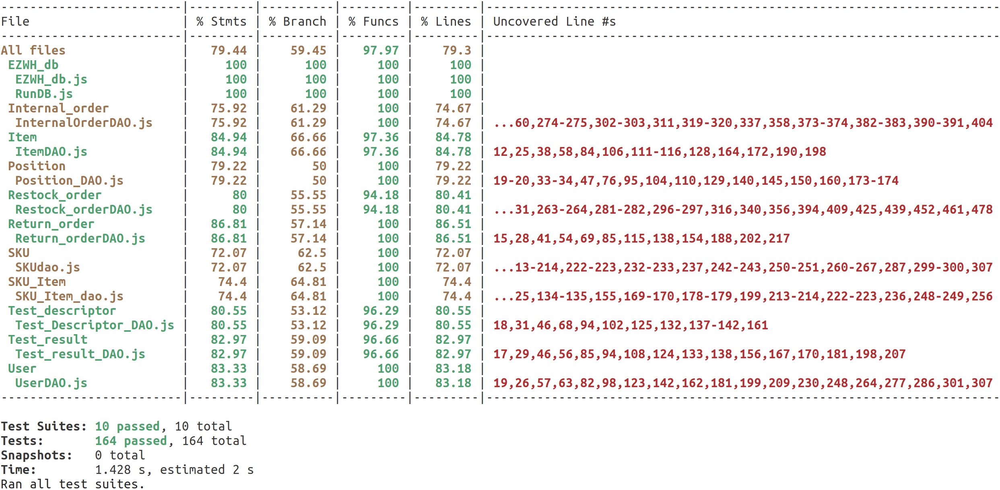

# Unit Testing Report

Date: 20/06/2022

Version: 1.1

# Contents

- [Black Box Unit Tests](#black-box-unit-tests)

- [White Box Unit Tests](#white-box-unit-tests)

# Black Box Unit Tests

 ## **Class *PositionDAO***

 ### **Class *PositionDAO* - method *getPositions()***

**Criteria for method *getPositions()*:**
 - Position exists
 - User has right permission

**Predicates for method *name*:**

| Criteria        | Predicate   |
|-----------------|-------------|
| Position exists (C1) | True, False |
| User has right permission (C2)  | True, False |

**Boundaries**:

No boundaries for boolean predicates.

**Combination of predicates**:
| Position exists (C1) | User has right permission (C2) | Valid / Invalid | Description of the test case                                                        | Jest test case  |
|----------------------|---------------------|-----------------|-------------------------------------------------------------------------------------|-----------------|
|           T          |          T          |      Valid      |               Position exists and user has right permission, correct data is returned.               | test_get_positions(); |
|           T          |          F          |     Invalid     | Position exists but the user has not the right permission, test fails. (Sessions still to be implemented) |  test_get_positions(); |
|           F          |          -          |     Invalid     |                          Position does not exists, test fails.                          |  test_get_positions(); |

 ### **Class *PositionDAO* - method *storePosition(position)***

**Criteria for method *storePosition(position)*:**
 - Position data are valid
 - User has right permission

**Predicates for method *name*:**

| Criteria        | Predicate   |
|-----------------|-------------|
| Position data are valid (C1) | True, False |
| User has right permission (C2)  | True, False |

**Boundaries**:

No boundaries for boolean predicates.

**Combination of predicates**:
| Position data are valid (C1) | User has right permission (C2) | Valid / Invalid | Description of the test case                                                        | Jest test case  |
|----------------------|---------------------|-----------------|-------------------------------------------------------------------------------------|-----------------|
|           T          |          T          |      Valid      |               Position data are valid and user has right permission, positionID is returned.               | test_new_position(); |
|           T          |          F          |     Invalid     | Position data are valid but the user has not the right permission, test fails. (Sessions still to be implemented) |  test_new_position(); |
|           F          |          -          |     Invalid     |                          Position date are not valid, test fails.                          |  test_new_position(); |

 ### **Class *PositionDAO* - method *put_position_by_ID_DB(positionID, body)***

**Criteria for method *put_position_by_ID_DB(positionID, body)*:**
 - Position data are valid
 -  Position with positionID exists
 - User has right permission

**Predicates for method *name*:**

| Criteria        | Predicate   |
|-----------------|-------------|
| Position data are valid (C1) | True, False |
| Position with positionID exists (C2)  | True, False |
| User has right permission (C3)  | True, False |

**Boundaries**:

No boundaries for boolean predicates.

**Combination of predicates**:
| Position data are valid (C1) | Position with positionID exists (C2)  | User has right permission (C3) | Valid / Invalid | Description of the test case                                                        | Jest test case  |
|----------------------|---------------------|-----------------|-----------------|-------------------------------------------------------------------------------------|-----------------|
|           T          |          T          | T |     Valid      |               Position data are valid, position with positionID exists in the DB and user has right permission, 'true' is returned.               | test_modify_position(); |
|           T          |          T          | F|     Invalid     | Position data are valid and the position to modify exists in the DB but the user has not the right permission, test fails. (Sessions still to be implemented) |  test_modify_position(); |
|           F          |          T          | -|    Invalid     |                          Position data are not valid, test fails.                          |  test_modify_position(); |
|           T          |          F          | -|    Invalid     |                          Position data is valid, but the position to modify doesn't exist in the DB, test fails.                          |  test_modify_position(); |

 ### **Class *PositionDAO* - method *put_positionID_by_ID_DB(positionID, body)***

**Criteria for method *put_positionID_by_ID_DB(positionID, body)*:**
 - New positionID ( from the body ) is valid
 - Position with positionID exists
 - User has right permission

**Predicates for method *name*:**

| Criteria        | Predicate   |
|-----------------|-------------|
| Position ID is valid (C1) | True, False |
| Position with positionID exists (C2)  | True, False |
| User has right permission (C3)  | True, False |

**Boundaries**:

No boundaries for boolean predicates.

**Combination of predicates**:
| Position ID is valid (C1) | Position with positionID exists (C2)  | User has right permission (C3) | Valid / Invalid | Description of the test case                                                        | Jest test case  |
|----------------------|---------------------|-----------------|-----------------|-------------------------------------------------------------------------------------|-----------------|
|           T          |          T          | T |     Valid      |               Position ID is valid, position with positionID exists in the DB and user has right permission, 'true' is returned.               | test_modify_position_ID(); |
|           T          |          T          | F|     Invalid     | Position ID is valid, position with positionID exists in the DB but the user has not the right permission, test fails. (Sessions still to be implemented) |  test_modify_position_ID(); |
|           F          |          T          | -|    Invalid     |                          Position ID is not valid, test fails.                          |  test_modify_position_ID(); |
|           T          |          F          | -|    Invalid     |                          Position ID is valid, but the position with positionID doesn't exist in the DB, test fails.                          |  test_modify_position_ID(); |

 ### **Class *PositionDAO* - method *delete_position_by_ID_DB(positionID)***

**Criteria for method *delete_position_by_ID_DB(positionID)*:**
 - Position with positionID exists in the DB
 - User has right permission

**Predicates for method *name*:**

| Criteria        | Predicate   |
|-----------------|-------------|
| Position with positionID exists in the DB (C1) | True, False |
| User has right permission (C2)  | True, False |

**Boundaries**:

No boundaries for boolean predicates.

**Combination of predicates**:
| Position with positionID exists in the DB (C1) | User has right permission (C2) | Valid / Invalid | Description of the test case                                                        | Jest test case  |
|----------------------|---------------------|-----------------|-------------------------------------------------------------------------------------|-----------------|
|           T          |          T          |      Valid      |               Position with positionID exists in the DB and user has right permission, 'true' is returned.               | test_delete_position(); |
|           T          |          F          |     Invalid     | Position with positionID exists in the DB but the user has not the right permission, test fails. (Sessions still to be implemented) |  test_delete_position(); |
|           F          |          -          |     Invalid     |                          Position with positionID doesn't exist in the DB, test fails.                          |  test_delete_position(); |

## **Class *TestDescriptorDAO***

 ### **Class *TestDescriptorDAO* - method *get_test_descriptors_DB()***

**Criteria for method *get_test_descriptors_DB()*:**
 - Test descriptor exists
 - User has right permission

**Predicates for method *name*:**

| Criteria        | Predicate   |
|-----------------|-------------|
| Test descriptor exists (C1) | True, False |
| User has right permission (C2)  | True, False |

**Boundaries**:

No boundaries for boolean predicates.

**Combination of predicates**:
| Test descriptor exists (C1) | User has right permission (C2) | Valid / Invalid | Description of the test case                                                        | Jest test case  |
|----------------------|---------------------|-----------------|-------------------------------------------------------------------------------------|-----------------|
|           T          |          T          |      Valid      |               Test descriptor exists and user has right permission, correct data is returned.               | test_get_test_descriptor(); |
|           T          |          F          |     Invalid     | Test descriptor exists but the user has not the right permission, test fails. (Sessions still to be implemented) |  test_get_test_descriptor(); |
|           F          |          -          |     Invalid     |                          Test Descriptor does not exists, test fails.                          |  test_get_test_descriptor(); |

 ### **Class *TestDescriptorDAO* - method *get_test_descriptor_by_ID_DB(id)***

**Criteria for method *get_test_descriptor_by_ID_DB(id)*:**
 - Test descriptor with 'id' exists
 - User has right permission

**Predicates for method *name*:**

| Criteria        | Predicate   |
|-----------------|-------------|
| Test descriptor with 'id' exists (C1) | True, False |
| User has right permission (C2)  | True, False |

**Boundaries**:

No boundaries for boolean predicates.

**Combination of predicates**:
| Test descriptor with 'id' exists (C1) | User has right permission (C2) | Valid / Invalid | Description of the test case                                                        | Jest test case  |
|----------------------|---------------------|-----------------|-------------------------------------------------------------------------------------|-----------------|
|           T          |          T          |      Valid      |               Test descriptor with 'id' exists and user has right permission, correct data is returned.               | test_get_test_descriptor_by_ID(); |
|           T          |          F          |     Invalid     | Test descriptor with 'id' exists but the user has not the right permission, test fails. (Sessions still to be implemented) |  test_get_test_descriptor_by_ID(); |
|           F          |          -          |     Invalid     |                          Test descriptor with 'id' does not exists, test fails.                          |  test_get_test_descriptor_by_ID(); |

### **Class *TestDescriptorDAO* - method *post_test_descriptor_DB(data)***

**Criteria for method *post_test_descriptor_DB(data)*:**
 - Test descriptor data are valid
 - User has right permission

**Predicates for method *name*:**

| Criteria        | Predicate   |
|-----------------|-------------|
| Test descriptor data are valid (C1) | True, False |
| User has right permission (C2)  | True, False |

**Boundaries**:

No boundaries for boolean predicates.

**Combination of predicates**:
| Test descriptor data are valid (C1) | User has right permission (C2) | Valid / Invalid | Description of the test case                                                        | Jest test case  |
|----------------------|---------------------|-----------------|-------------------------------------------------------------------------------------|-----------------|
|           T          |          T          |      Valid      |               Test descriptor data are valid and user has right permission, 'true' is returned.               | test_new_test_descriptor(); |
|           T          |          F          |     Invalid     | Test descriptor data are valid but the user has not the right permission, test fails. (Sessions still to be implemented) |  test_new_test_descriptor(); |
|           F          |          -          |     Invalid     |                          Test descriptor data are not valid, test fails.                          |  test_new_test_descriptor(); |

### **Class *TestDescriptorDAO* - method *put_test_descriptor_by_ID_DB(id, body)***

**Criteria for method *put_test_descriptor_by_ID_DB(id, body)*:**
 - Test descriptor data ( body ) are valid
 - Test descriptor with 'id' exists
 - User has right permission

**Predicates for method *name*:**

| Criteria        | Predicate   |
|-----------------|-------------|
| Test descriptor data ( body ) are valid (C1) | True, False |
| Test descriptor with 'id' exists (C2) | True, False |
| User has right permission (C3)  | True, False |

**Boundaries**:

No boundaries for boolean predicates.

**Combination of predicates**:
| Test descriptor data ( body ) are valid (C1) | Test descriptor with 'id' exists (C2)  | User has right permission (C3) | Valid / Invalid | Description of the test case                                                        | Jest test case  |
|----------------------|---------------------|-----------------|-----------------|-------------------------------------------------------------------------------------|-----------------|
|           T          |          T          | T |     Valid      |               Test Descriptor data are valid, Test Descriptor with id exists in the DB and user has right permission, 'true' is returned.               | test_modify_test_descriptor(); |
|           T          |          T          | F|     Invalid     | Test Descriptor data are valid, Test Descriptor with id exists in the DB but the user has not the right permission, test fails. (Sessions still to be implemented) |  test_modify_test_descriptor(); |
|           F          |          T          | -|    Invalid     |                          Test Descriptor data are not valid, test fails.                          |  test_modify_position_ID(); |
|           T          |          F          | -|    Invalid     |                          Test Descriptor data are valid, but Test Descriptor with id doesn't exist in the DB, test fails.                          |  test_modify_test_descriptor(); |

### **Class *TestDescriptorDAO* - method *delete_test_descriptor_by_ID_DB(id)***

**Criteria for method *delete_test_descriptor_by_ID_DB(id)*:**
 - Test descriptor with 'id' exists
 - User has right permission

**Predicates for method *name*:**

| Criteria        | Predicate   |
|-----------------|-------------|
| Test descriptor with 'id' exists (C1) | True, False |
| User has right permission (C2)  | True, False |

**Boundaries**:

No boundaries for boolean predicates.

**Combination of predicates**:
| Test descriptor with 'id' exists (C1) | User has right permission (C2) | Valid / Invalid | Description of the test case                                                        | Jest test case  |
|----------------------|---------------------|-----------------|-------------------------------------------------------------------------------------|-----------------|
|           T          |          T          |      Valid      |               Test descriptor with 'id' exists and user has right permission, 'true' is returned.               | test_delete_test_descriptor(); |
|           T          |          F          |     Invalid     | Test descriptor with 'id' exists but the user has not the right permission, test fails. (Sessions still to be implemented) |  test_delete_test_descriptor(); |
|           F          |          -          |     Invalid     |                          Test descriptor with 'id' doesn't exist, test fails.                          |  test_delete_test_descriptor(); |

## **Class *TestResultDAO***

 ### **Class *TestResultDAO* - method *get_test_results_DB(rfid)***

**Criteria for method *get_test_results_DB(rfid)*:**
 - SkuItem with 'rfid' exists
 - User has right permission

**Predicates for method *name*:**

| Criteria        | Predicate   |
|-----------------|-------------|
| SkuItem with 'rfid' exists (C1) | True, False |
| User has right permission (C2)  | True, False |

**Boundaries**:

No boundaries for boolean predicates.

**Combination of predicates**:
| SkuItem with 'rfid' exists (C1) | User has right permission (C2) | Valid / Invalid | Description of the test case                                                        | Jest test case  |
|----------------------|---------------------|-----------------|-------------------------------------------------------------------------------------|-----------------|
|           T          |          T          |      Valid      |               SkuItem with 'rfid' exists and user has right permission, correct data is returned.               | test_get_test_result(); |
|           T          |          F          |     Invalid     | SkuItem with 'rfid' exists but the user has not the right permission, test fails. (Sessions still to be implemented) |  test_get_test_result(); |
|           F          |          -          |     Invalid     |                          SkuItem with 'rfid' doesn't exists, test fails.                          |  test_get_test_result(); |

### **Class *TestResultDAO* - method *get_test_result_with_id_from_rfid_DB(id, rfid)***

**Criteria for method *get_test_result_with_id_from_rfid_DB(id, rfid)*:**
 - SkuItem with 'rfid' exists
 - Test Result with 'id' exists
 - User has right permission

**Predicates for method *name*:**

| Criteria        | Predicate   |
|-----------------|-------------|
| SkuItem with 'rfid' exists (C1) | True, False |
| Test Result with 'id' exists (C2) | True, False |
| User has right permission (C3)  | True, False |

**Boundaries**:

No boundaries for boolean predicates.

**Combination of predicates**:
| SkuItem with 'rfid' exists (C1) | Test Result with 'id' exists (C2)  | User has right permission (C3) | Valid / Invalid | Description of the test case                                                        | Jest test case  |
|----------------------|---------------------|-----------------|-----------------|-------------------------------------------------------------------------------------|-----------------|
|           T          |          T          | T |     Valid      |               SkuItem with 'rfid' exists, Test Result with 'id' exists in the DB and user has right permission, correct data is returned.               | test_get_test_result_with_ID_by_RFID(); |
|           T          |          T          | F|     Invalid     | Test SkuItem with 'rfid' exists, Test Result with 'id' exists in the DB but the user has not the right permission, test fails. (Sessions still to be implemented) |  test_get_test_result_with_ID_by_RFID(); |
|           F          |          -         | -|    Invalid     |                          SkuItem with 'rfid' doesn't exists, test fails.                          |  test_get_test_result_with_ID_by_RFID(); |
|           T          |          F          | -|    Invalid     |                          SkuItem with 'rfid' exists, but Test Result with 'id' doesn't exists in the DB, test fails.                          |  test_get_test_result_with_ID_by_RFID(); |

### **Class *TestResultDAO* - method *post_test_result_DB(data)***

**Criteria for method *post_test_result_DB(data)*:**
 - Data are valid
 - User has right permission

**Predicates for method *name*:**

| Criteria        | Predicate   |
|-----------------|-------------|
| Data are valid (C1) | True, False |
| User has right permission (C2)  | True, False |

**Boundaries**:

No boundaries for boolean predicates.

**Combination of predicates**:
| Data are valid (C1) | User has right permission (C2) | Valid / Invalid | Description of the test case                                                        | Jest test case  |
|----------------------|---------------------|-----------------|-------------------------------------------------------------------------------------|-----------------|
|           T          |          T          |      Valid      |               Data are valid and user has right permission, 'Test Result succesfully added to the Database!' is returned.               | test_new_test_result(); |
|           T          |          F          |     Invalid     | Data are valid but the user has not the right permission, test fails. (Sessions still to be implemented) |  test_new_test_result(); |
|           F          |          -          |     Invalid     |                          Data are not valid, test fails.                          |  test_new_test_result(); |

### **Class *TestResultDAO* - method *put_test_result_with_id_from_rfid_DB(id, rfid, data)***

**Criteria for method *put_test_result_with_id_from_rfid_DB(id, rfid, data)*:**
 - SkuItem with 'rfid' exists
 - Test Result with 'id' exists
 - Data are valid
 - User has right permission

**Predicates for method *name*:**

| Criteria        | Predicate   |
|-----------------|-------------|
| SkuItem with 'rfid' exists (C1) | True, False |
| Test Result with 'id' exists (C2) | True, False |
| Data are valid (C3)  | True, False |
| User has right permission (C4)  | True, False |

**Boundaries**:

No boundaries for boolean predicates.

**Combination of predicates**:
| SkuItem with 'rfid' exists (C1) | Test Result with 'id' exists (C2)  | Data are valid (C3) | User has right permission (C4) | Valid / Invalid | Description of the test case                                                        | Jest test case  |
|----------------------|---------------------|-----------------|-----------------|-------------------------------------------------------------------------------------|-----------------|--------|
|           T          |  T  | T | T |     Valid      |               SkuItem with 'rfid' exists, Test Result with 'id' exists in the DB, Data are valid and user has right permission, correct data is returned.               | test_modify_test_result_with_ID_from_RFID(); |
|           T          |          T          | T| F |   Invalid     | Test SkuItem with 'rfid' exists, Test Result with 'id' exists in the DB, Data are valid but the user has not the right permission, test fails. (Sessions still to be implemented) |  test_modify_test_result_with_ID_from_RFID(); |
|           F          |          -         | -| -|   Invalid     |                          SkuItem with 'rfid' doesn't exists, test fails.                          |  test_modify_test_result_with_ID_from_RFID(); |
|           T          |          F          | -| - |   Invalid     |                          SkuItem with 'rfid' exists, but Test Result with 'id' doesn't exists in the DB, test fails.                          |  test_modify_test_result_with_ID_from_RFID(); |
|           T          |          T          | F| - |   Invalid     |                          SkuItem with 'rfid' exists, Test Result with 'id' exists in the DB but data are not valid, test fails.                          |  test_modify_test_result_with_ID_from_RFID(); |

### **Class *TestResultDAO* - method *delete_test_result_with_id_from_rfid_DB(id, rfid)***

**Criteria for method *delete_test_result_with_id_from_rfid_DB(id, rfid)*:**
 - Test Result with 'id' exists
 - SkuItem with 'rfid' exists
 - User has right permission

**Predicates for method *name*:**

| Criteria        | Predicate   |
|-----------------|-------------|
| Test Result with 'id' exists (C1) | True, False |
| SkuItem with 'rfid' exists (C2)  | True, False |
| User has right permission (C3)  | True, False |

**Boundaries**:

No boundaries for boolean predicates.

**Combination of predicates**:
| Test Result with 'id' exists (C1) | SkuItem with 'rfid' exists (C2) | User has right permission (C3) | Valid / Invalid | Description of the test case                                                        | Jest test case  |
|----------------------|---------------------|-----------------|-------------------------------------------------------------------------------------|-----------------|-------|
|           T          |          T          | T |     Valid      |               Test Result with 'id' exists, SkuItem with 'rfid' exists and user has right permission, 'true' is returned.               | test_delete_test_result_with_id_from_rfid(); |
|           T          |          T          | F |   Invalid     | Test Result with 'id' exists, SkuItem with 'rfid' exists, but user has not the right permission, test fails. (Sessions still to be implemented) |  test_new_test_result(); |
|           F          |          -          | - |   Invalid     |                          Test Result with 'id' doesn't exists, test fails.                          |  test_new_test_result(); |
|           T          |          F          | - |   Invalid     |                          Test Result with 'id' exists but SkuItem with 'rfid' doesn't exists, test fails.                          |  test_new_test_result(); |

 ## **Class *UserDAO***

 ### **Class *UserDAO* - method *getUser(data)***

**Criteria for method *getUser(data)*:**
 - Username exists
 - User is logged

**Predicates for method *name*:**

| Criteria        | Predicate   |
|-----------------|-------------|
| Username exists (C1) | True, False |
| User is logged (C2)  | True, False |

**Boundaries**:

No boundaries for boolean predicates.

**Combination of predicates**:
| Username exists (C1) | User is logged (C2) | Valid / Invalid | Description of the test case                                                        | Jest test case  |
|----------------------|---------------------|-----------------|-------------------------------------------------------------------------------------|-----------------|
|           T          |          T          |      Valid      |               User exists and is logged in, correct data is returned.               | testGetUser (); |
|           T          |          F          |     Invalid     | User exists but it is not logged in, test fails. (Sessions still to be implemented) |  testGetUser(); |
|           F          |          -          |     Invalid     |                          User does not exists, test fails.                          |  testGetUser(); |

### **Class *UserDAO* - method *getSuppliers()***

**Criteria for method *getSuppliers()*:**
 - Suppliers registered in the system (C1)
 - DB queries successfull (C2)

**Predicates for method *getSuppliers()*:**

| Criteria | Predicate   |
|----------|-------------|
|    C1    | True, False |
|    C2    | True, False |

**Boundaries**:

No boundaries for boolean predicates.

**Combination of predicates**:
| Suppliers registered in the system (C1) | DB queries successfull (C2) | Valid / Invalid | Description of the test case                                 | Jest test case                      |
|-----------------------------------------|-----------------------------|-----------------|--------------------------------------------------------------|-------------------------------------|
|                    T                    |              T              |      Valid      | Method expected to return an array of suppliers data objects | testGetSuppliers([{...},{...},...); |
|                    F                    |              T              |      Valid      |           Method expected to return an empty array           |        testGetSuppliers([]);        |
|                    -                    |              F              |     Invalid     |                     DB error, test fails                     |         testGetSuppliers ();        |

### **Class *UserDAO* - method *getUsers()***

**Criteria for method *getUsers()*:**
 - Users registered in the system (C1)
 - DB queries successfull (C2)

**Predicates for method *getUsers()*:**

| Criteria | Predicate   |
|----------|-------------|
|    C1    | True, False |
|    C2    | True, False |

**Boundaries**:

No boundaries for boolean predicates.

**Combination of predicates**:

| Users registered in the system (C1) | DB queries successfull (C2) | Valid / Invalid | Description of the test case                                 | Jest test case                      |
|-----------------------------------------|-----------------------------|-----------------|--------------------------------------------------------------|-------------------------------------|
|                    T                    |              T              |      Valid      | Method expected to return an array of users data objects | testGetUsers([{...},{...},...); |
|                    F                    |              T              |      Valid      |           Method expected to return an empty array           |        testGetUsers([]);        |
|                    -                    |              F              |     Invalid     |                     DB error, test fails                     |         testGetUsers ();        |

### **Class *UserDAO* - method *newUser(newUserData)***

**Criteria for method *newUser(newUserData)*:**
 - New user does not already exist in the system (C1)
 - DB queries successfull (C2)
 - (Note: data format is checked at API level, so it is considered correct at DAO level).

**Predicates for method *newUser(newUserData)*:**

| Criteria | Predicate   |
|----------|-------------|
|    C1    | True, False |
|    C2    | True, False |

**Boundaries**:

No boundaries for boolean predicates.

**Combination of predicates**:
| New user does not already exist in the system (C1) | DB queries successfull (C2) | Valid / Invalid |                 Description of the test case                 |                                                                            Jest test case                                                                           |
|:----------------------------------------------------:|:---------------------------:|:---------------:|:------------------------------------------------------------:|:-------------------------------------------------------------------------------------------------------------------------------------------------------------------:|
|                          T                         |              T              |      Valid      | Method expected to return 2 01 for successful user creation. |                            testNewUser('dscre@ezwh.com','Simone','Crescenzo','testpassword','manager', 201); (one for each kind of user)                            |
|                          F                         |              T              |     Invalid     |            Method expected to return 409 Conflict.           | testNewUser('dscre@ezwh.com','Simone','Crescenzo','testpassword','manager', 201); testNewUser('dscre@ezwh.com','Simone','Crescenzo','testpassword','manager', 409); |
|                          -                         |              F              |     Invalid     |                     DB error, test fails                     |                                                                            testNewUser();                                                                           |

### **Class *UserDAO* - method *userSession(userData)***

**Criteria for method *userSession(userData)*:**
 - User registered (C1)
 - User logged in (C2)
 - DB queries successfull (C3)
 - (Note: data format is checked at API level, so it is considered correct at DAO level).

**Predicates for method *name*:**

| Criteria |  Predicate  |
|:--------:|:-----------:|
|    C1    | True, False |
|    C2    | True, False |
|    C3    | True, False |

**Boundaries**:

No boundaries for boolean predicates.

**Combination of predicates**:
| User registered (C1) | User logged in (C2) | DB queries successfull (C3) | Valid / Invalid |         Description of the test case        |                                Jest test case                                |
|:--------------------:|:-------------------:|:---------------------------:|:---------------:|:-------------------------------------------:|:----------------------------------------------------------------------------:|
|           T          |          T          |              T              |      Valid      | Method expected to return user data object. |    testUserSession('dscre@ezwh.com','testpassword','manager',1,'Simone');    |
|           T          |          F          |              T              |     Invalid     |        Method expected to return 401.       |    testUserSession('dscre@ezwh.com','wrongpassword','manager',1,'Simone');   |
|           F          |          -          |              T              |     Invalid     |        Method expected to return 401.       | testUserSession('notexisting@ezwh.com','testpassword','manager',1,'Simone'); |
|           -          |          -          |              F              |     Invalid     |        Method expected to return 500.       |                              testUserSession();                              |

### **Class *UserDAO* - method *modifyUserType(newUserData)***

**Criteria for method *modifyUserType(newUserData)*:**
 - User exists (C1)
 - DB queries successfull (C2)
 - (Note: data format is checked at API level, so it is considered correct at DAO level).

**Predicates for method *modifyUserType(newUserData)*:**

| Criteria |  Predicate  |
|:--------:|:-----------:|
|    C1    | True, False |
|    C2    | True, False |

**Boundaries**:

No boundaries for boolean predicates.

**Combination of predicates**:
| User exists (C1) | DB queries successfull (C2) | Valid / Invalid |  Description of the test case  |                              Jest test case                              |
|:----------------:|:---------------------------:|:---------------:|:------------------------------:|:------------------------------------------------------------------------:|
|         T        |              T              |      Valid      | Method expected to return 200. |    testModifyUserType('supp3@ezwh.com', 'supplier', 'customer', 200);    |
|         F        |              T              |     Invalid     | Method expected to return 404. | testModifyUserType('notexisting@ezwh.com', 'supplier', 'customer', 404); |
|         -        |              F              |     Invalid     | Method expected to return 500. |                           testModifyUserType();                          |

### **Class *UserDAO* - method *deleteUser(userData)***

**Criteria for method *deleteUser(userData)*:**
- DB queries successfull (C1)
- (Note: data format is checked at API level, so it is considered correct at DAO level).

**Predicates for method *deleteUser(userData)*:**

| Criteria |  Predicate  |
|:--------:|:-----------:|
|    C1    | True, False |

**Boundaries**:

No boundaries for boolean predicates.

**Combination of predicates**:
| DB queries successful (C1) | Valid / Invalid |  Description of the test case  |               Jest test case              |
|:--------------------------:|:---------------:|:------------------------------:|:-----------------------------------------:|
|              T             |      Valid      | Method expected to return 204. | testDeleteUser('user1@ezwh.com','clerk'); |
|              F             |     Invalid     | Method expected to return 500. |             testDeleteUser();             |

## **Class *ItemDAO***

The implementation strategy used to create the ItemDAO class was to move the validation of the parameters within the associated API class and to implement within the DAO class only the methods to execute queries to the database, which receive input data already validated.

For this reason, the associated criteria and predicates in black box testing are only related to the operations performed by the query and refer only to errors generated by SQL.

 ### **Class *ItemDAO* - method *getItemByID(data)***

**Criteria for method *getItemByID(data)*:**
	

 - data.id is composed by digits only
 - data.id exists in DB or not 
 - couple data.id and data.supplierId already exists in DB or not 

**Predicates for method *getItemByID(data)*:**

| Criteria | Predicate |
| -------- | --------- |
|       data.id is digits only       |    True, False       |
|       data.id exists               |    True, False         |
| couple data.supplierId and data.id exits in DB        | True, False        |

**Boundaries**:

No boundaries for boolean predicates.

**Combination of predicates**:

|  data.id is digits only  | data.id exists| couple data.supplierID and data.ID exists | Valid / Invalid | Description of the test case | Jest test case |
|-------|-------|-------|-------|-------|-------|
|T|T|T|Valid| Method expects to return the Item specified by the ID |     testGetItemById(2,2,{id:2,description:'New item',price:10.99, SKUId:1,supplierId:1});|
|T|T|F|Invalid| Specified couple id,SupplierId doesn't exists |   testGetItemById(2,1,{id:2,description:'New item',price:10.99, SKUId:1,supplierId:1});|
|T|F||Invalid| Method expects to return empty object {}  |testGetItemById(3,2,{});|
|F|||Invalid| Method expects to return an empty object {} |testGetItemById('A',2,{}); |

### **Class *ItemDAO* - method *storeItem(data)***

**Criteria for method *storeItem(data)*:**
 - data.id already exist in DB
 - no missing fields in data object 
 - couple data.id and data.supplierId doesn't exsits in DB

**Predicates for method *storeItem(data)*:**

| Criteria | Predicate |
| -------- | --------- |
|     data.id already exist in DB     |      True, False     |
|     data.SKUId exists in SKU table    |   True, False        |
| couple data.supplierId and data.id exits in DB or not      | True, False        |

**Boundaries**:

No boundaries for boolean predicates.

**Combination of predicates**:

| data.id already exist in DB | data.SKUId exists in SKU table | couple data.supplierId and data.id exists  | Valid / Invalid | Description of the test case | Jest test case |
|-------|-------|-------|-------|-------|-------|
|F|T|F|Valid| Method expects to return 201, SKUId=1 exists in DB | testStoreItem(2, 'New item', 10.99, 1, 1, 201); |
|F|T|T|Invalid| Couple supplierId and ID already existts | testStoreItem(2, 'New item', 10.99, 1, 2, 201); |
|F|F|F|Invalid| Method returns 404 because SKUId specified doesn't exist | testStoreItem(1, 'New item', 10.99, 2, 1, 404); |
|T|||Invalid| Method returns 503 because ItemID is already stored |testStoreItem(2, 'New item', 10.99, 1, 1, 503);|

### **Class *ItemDAO* - method *updateItem(data,params)***

**Criteria for method *updateItem(data,params)*:**
	
- params.id already exist in DB
- couple params.supplierId and params.id already exists in DB

**Predicates for method *updateItem(data,params)*:**

| Criteria | Predicate |
| -------- | --------- |
|   params.id already exist in DB       |      True, False      |
|   couple params.id and params.supplierId exist in DB     |      True, False      |

**Boundaries**:

No boundaries for boolean predicates.

**Combination of predicates**:

| params.id already exist in DB  | couple params.id and params.supplierId exist in DB | Valid / Invalid | Description of the test case | Jest test case |
|-------|-------|-------|-------|-------|
|T|T|Valid| Method expects to return 200 |testUpdateItem(2,2,'New description',9.99,200);|
|T|F|Invalid| Couple ID and supplierId doesn't exists in DB |testUpdateItem(2,1,'New description',9.99,200);|
|F|-| Invalid | Check on ID is performed by another function, so this function will always receive a valid ID. | 

## **Class *Restock_orderDAO***
### **Class *Restock_orderDAO* - method *getRestockOrderByID(data)***

**Criteria for method *getRestockOrderByID(data)*:**
	
 - data.id already exists in DB
 

**Predicates for method *getRestockOrderByID(data)*:**

| Criteria | Predicate |
| -------- | --------- |
|    data.id already exists in DB      |  True, False         |

**Boundaries**:

No boundaries for boolean predicates.

**Combination of predicates**:

| data.id already exists in DB| Valid / Invalid | Description of the test case | Jest test case |
|-------|-------|-------|-------|
|T|Valid| Method expects to return the restock order given| testGetRestockOrderByID(1,{ id:1, issueDate: "2021/11/29 09:33", state: "ISSUED", products: [{ SKUId:1,itemId:10,description: "New PC", price: 1.99, qty: 30},{ SKUId:2, itemId:18, description: "New Pen", price: 10.99, qty: 15  }],supplierId: 1,transportNote: {},skuItems:[] });|
|F|Invalid| Method expects to return undefined|    testGetRestockOrderByID(1,undefined);|

### **Class *Restock_orderDAO* - method *addTransportNote(data,params)***

**Criteria for method *addTransportNote(data,params)*:**

 - params.id exists or not
 - order state == DELIVERED
 - data.deliveryDate is before issueDate

**Predicates for method *addTransportNote(data,params)*:**

| Criteria | Predicate |
| -------- | --------- |
|   params.id exists or not       |    True, False       |
|    order state === "DELIVERED"      |    True, False       |
|    data.deliveryDate is before issueDate      |     True, False      |

**Boundaries**:

No boundaries for boolean predicates.

**Combination of predicates**:

| params.id exists or not | order state == "DELIVERED"  | data.deliveryDate is before issueDate | Valid / Invalid | Description of the test case | Jest test case |
|-------|-------|-------|-------|-------|-------|
|T|T|T|Valid|Method expects to return 200|testAddTransportNote(2,{deliveryDate:"2022/05/22 09:33"},200);|
|T|T|F|Invalid|Method expects to return 422|testAddTransportNote(2,{deliveryDate:"2022/05/20 09:33"},422);|
|T|F||Invalid|Method expects to return 422|testAddTransportNote(1,{deliveryDate:"2022/05/20 09:33"},422);|
|F|||Invalid|Check on ID is performed by another function, so this function will always receive a valid ID.||

 ### **Class *Return_orderDAO* - method *getReturnOrderbyId(data)***

**Criteria for method *getReturnOrderbyId(data)*:**
	
 - data.id exists or not 

**Predicates for method *getReturnOrderbyId(data)*:**

| Criteria | Predicate |
| -------- | --------- |
|    data.id exists or not       |   True, False        |

**Boundaries**:

No boundaries for boolean predicates.

**Combination of predicates**:

| data.id exists or not | Valid / Invalid | Description of the test case | Jest test case |
|-------|-------|-------|-------|
|T|Valid|Method must return the return order specified, including the list of products given|    testGetReturnOrderById(1,[{id: 1,products:  [{RFID: "12345678901234567890123456789015",SKUId: 1,description: "New Item",itemId: 10,price: 10.99},{RFID: "12325678901534567790123456789015",SKUId: 2,description: "New Item",itemId: 18,price: 10.99 }],restockOrderId: 2,returnDate: "2021/11/29 09:33" }]);|
|F|Invalid|Method must return 404 if the specified ID doesn't exist|    testGetReturnOrderById(1,404);|

 ### **Class *Return_orderDAO* - method *deleteReturnOrder(data)***

**Criteria for method *deleteReturnOrder(data)*:**
	
 - data.id exists or not 

**Predicates for method *deleteReturnOrder(data)*:**

| Criteria | Predicate |
| -------- | --------- |
|    data.id exists or not       |   True, False        |

**Boundaries**:

No boundaries for boolean predicates.

**Combination of predicates**:

| data.id exists or not | Valid / Invalid | Description of the test case | Jest test case |
|-------|-------|-------|-------|
|T|Valid|Method must return 404 because test case calls getReturnOrderbyId after performing delete operation.  |  testDeleteReturnOrder(1,404);|
|F|Invalid|Method always receives existing ID because check is done in API level function.|

## **Class *InternalOrderDAO***

### **Class *InternalOrderDAO* - method *getInternalOrders()***

**Criteria for method *getInternalOrders()*:**
 - DB queries successfull (C1)
 - (Note: data format is checked at API level, so it is considered correct at DAO level).

**Predicates for method *getInternalOrders()*:**

|  Criteria  |  Predicate    |
|:----------:|:-------------:|
|     C1     |  True, False  |

**Boundaries**:

No boundaries for boolean predicates.

**Combination of predicates**:
| DB queries successfull(C1) | Valid / Invalid |         Description of the test case        |           Jest test case           |
|:--------------------------:|:---------------:|:-------------------------------------------:|:----------------------------------:|
|              T             |      Valid      | Method expected to return user data object. | testGetInternalOrders(resExpected) |
|              F             |     Invalid     |        Method expected to return 500.       |                  -                 |

### **Class *InternalOrderDAO* - method *createInternalOrder()***

**Criteria for method *createInternalOrder()*:**
 - DB queries successfull (C1)
 - (Note: data format is checked at API level, so it is considered correct at DAO level).

**Predicates for method *createInternalOrder()*:**

|  Criteria  |  Predicate    |
|:----------:|:-------------:|
|     C1     |  True, False  |

**Boundaries**:

No boundaries for boolean predicates.

**Combination of predicates**:
| DB queries successfull(C1) | Valid / Invalid |         Description of the test case        |                 Jest test case                 |
|:--------------------------:|:---------------:|:-------------------------------------------:|:----------------------------------------------:|
|              T             |      Valid      | Method expected to return user data object. | testCreateInternalOrder(orderData,resExpected) |
|              F             |     Invalid     |        Method expected to return 500.       |                        -                       |

### **Class *InternalOrderDAO* - method *modifyInternalOrderState()***

**Criteria for method *modifyInternalOrderState()*:**
 - DB queries successfull (C1)
 - (Note: data format is checked at API level, so it is considered correct at DAO level).

**Predicates for method *modifyInternalOrderState()*:**

|  Criteria  |  Predicate    |
|:----------:|:-------------:|
|     C1     |  True, False  |

**Boundaries**:

No boundaries for boolean predicates.

**Combination of predicates**:
| DB queries successfull(C1) | Valid / Invalid |         Description of the test case        |                 Jest test case                 |
|:--------------------------:|:---------------:|:-------------------------------------------:|:----------------------------------------------:|
|              T             |      Valid      | Method expected to return user data object. | testModifyInternalOrder(orderData, resExpected) |
|              F             |     Invalid     |        Method expected to return 500.       |                        -                       |

### **Class *InternalOrderDAO* - method *deleteInternalOrder()***

**Criteria for method *deleteInternalOrder()*:**
 - DB queries successfull (C1)
 - (Note: data format is checked at API level, so it is considered correct at DAO level).

**Predicates for method *deleteInternalOrder()*:**

|  Criteria  |  Predicate    |
|:----------:|:-------------:|
|     C1     |  True, False  |

**Boundaries**:

No boundaries for boolean predicates.

**Combination of predicates**:
| DB queries successfull(C1) | Valid / Invalid |         Description of the test case        |                 Jest test case                 |
|:--------------------------:|:---------------:|:-------------------------------------------:|:----------------------------------------------:|
|              T             |      Valid      | Method expected to return user data object. | testDeleteInternalOrder(orderID, resExpected) |
|              F             |     Invalid     |        Method expected to return 500.       |                        -                       |

 ### **Class *SKUDao* - method *getSKUs()***

**Criteria for method *getSKUs()*:**
	

 - DB queries successful
 - SKUs exist

**Predicates for method *newSKU(sku)*:**

| Criteria | Predicate |
| -------- | --------- |
|DB queries successful | True, False |
|SKUs exist | True, False |

**Boundaries**:

No boundaries for boolean predicates.

**Combination of predicates**:

|  DB queries successful | SKUs exist | Valid / Invalid | Description of the test case | Jest test case |
|-------|-------|-------|-------|-------|
|F|-|Invalid|DB error, test fails|testGetSKUs()|
|T|F|Valid|Test is successful, an empty array is returned|testGetSKUs([])|
|T|T|Valid|Skus are returned| testGetSKUs(skus)|

 ### **Class *SKUDao* - method *modifySKU(id, description, weight, volume, notes, price, availableQuantity, expected)***

**Criteria for method *modifySKU(...)*:**
	
 - SKUId exists
- Queries are successful
-User is logged in

**Predicates for method *name*:**

| Criteria | Predicate |
| -------- | --------- |
|     SKUId exists     |      True, False     |
|     Queries are successful     |     True, False      |
| User is logged in | True, False |

**Boundaries**:

No boundaries for boolean values

**Combination of predicates**:

| SKUId exists | Queries are successful | User is logged in| Valid / Invalid | Description of the test case | Jest test case |
|-------|-------|-------|-------|-------|-------|
|T|F| T|Invalid|Test fails because of a DB error|testModifySKU(2, "description", 14, 12, "note", 10000.56, 13, 200)|
|T|T| T|Valid|The SKU with ID= skuid is modified|testModifySKU(2, "description", 14, 12, "note", 10000.56, 13, 200)|
|F|-| T|Invalid|The test is expected to return error 404 |testModifySKU(18, "description", 14, 12, "note", 10000.56, 13, 404)|
|-|-|F|Invalid| Test returns error 401| |

 ### **Class *SKUDao* - method *modifySKUPosition(id, position, expected)***

**Criteria for method *modifySKUPosition(...)*:**
	
 - SKUId exists
- Queries are successful
-Position id exists
-Position associated to another SKU

**Predicates for method *name*:**

| Criteria | Predicate |
| -------- | --------- |
|     SKUId exists     |      True, False     |
|     Queries are successful     |     True, False      |
| Position id exists | True, False |
|Position associated to another SKU| True, False|
|Volume<availableVolume and weight< availableWeight C5| True, False |
|Volume>0 and Weight>0 C6| True, False|

**Boundaries**:

Volume == 0, Weight == 0
Volume == availableVolume, Weight == availableWeight

**Combination of predicates**:

| SKUId exists | Queries are successful | Position id exists|Position associated to another SKU| C5 | C6 |Valid / Invalid | Description of the test case | Jest test case |
|-------|-------|-------|-------|-------|-------|-------|-------|-------|
|F| -|-|-|-|-| Invalid| The test returns the error code 422 | testModifySKUPosition(16, "800234523412", 422)|
|T| F | T| T|-|-| Invalid | The tests return a sqlite error||
|T|T|F|F|-|-| Invalid | The test returns a 422 error| testModifySKUPosition(1, "800234523", 422)||
|T|T| T| F|T|T| Valid | The test is successful |testModifySKUPosition(2, "800234525144", 200)|
|T|T|T|T|-|-| Invalid | The test returns a 422 error | testModifySKUPosition(2, "800234525144", 422)|

### **Class *SKUItemDao* - method *newSKUItem(skuItem)***

**Criteria for method *newSKUItem(skuItem)*:**
	
- SKU exists

**Predicates for method *name*:**

| Criteria | Predicate |
| -------- | --------- |
|SKU exists | True, False |

**Boundaries**:

No boundaries for boolean values

**Combination of predicates**:

|SKU exists | Valid / Invalid | Description of the test case | Jest test case |
|-------|-------|-------|-------|
|F| Invalid | Test returns 404 |testNewSKUItem("12345678901234567890123456789015", 2, "2021/11/29 12:30", 404) |
|T| Valid | Test is successful | testNewSKUItem("12345678901234567890123456789015", 1, "2021/11/29 12:30", 201)|

### **Class *SKUItemDao* - method *getSKUItemsBySKUID(skuid)***

**Criteria for method *getSKUItemsBySKUID(skuid)*:**
	
- SKU exists
-User logged in

**Predicates for method *name*:**

| Criteria | Predicate |
| -------- | --------- |
|SKU exists | True, False |
| User logged in | True, False |

**Boundaries**:

No boundaries for boolean values

**Combination of predicates**:

|SKU exists | User logged in| Valid / Invalid | Description of the test case | Jest test case |
|-------|-------|-------|-------|-------|
|F| T| Invalid | Test returns error 401 |testGetSKUItemsBySKUId(2, 404) |
|T| T| Valid | Test is successful | testGetSKUItemsBySKUId(1, skuitem)|
|-| F| Invalid | Test returns error 401 | |

### **Class *SKUItemDao* - method *modifySKUItem(data)***

**Criteria for method *modifySKUItem(data)*:**
	
- SKU Item Rfid exists

**Predicates for method *name*:**

| Criteria | Predicate |
| -------- | --------- |
|SKU Item Rfid exists | True, False |

**Boundaries**:

No boundaries for boolean values

**Combination of predicates**:

|SKU Item Rfid exists| Valid / Invalid | Description of the test case | Jest test case |
|-------|-------|-------|-------|
|T| Valid | Test is successful | testModifySKUItem("12345678901234567890123456789014", "12345678901234567890123456789014", 1, "2021/11/29 12:31", 200)|
|F| Invalid | Test returns error 404| testModifySKUItem("12345678901234567890123456789015", "12345678901234567890123456789015", 1, "2021/11/29 12:30", 404)|

# White Box Unit Tests

### Test cases definition
    
    

| Unit name | Jest test case |
|--|--|
|storeItem|testStoreItem|
|updateItem|testUpdateItem|
|getItemByID|testGetItemById|
|getSKUIDbyItemID|testGetSKUIDbyItemID|
|getItembyIdSupp|testGetItembyIdSupp|
|getItems|testGetItems|
|deleteItem|testDeleteItem|
|getRestockOrders|testGetRestockOrders|
|getRestockOrdersIssued|testGetRestockOrdersIssued|
|getRestockOrderDeliveredByID|testGetRestockOrderDeliveredByID|
|getItemList|testGetItemList|
|checkItemList|testCheckItemList|
|getRestockOrderByID|testGetRestockOrderByID|
|storeRestockOrder|testStoreRestockOrder|
|storeProducts|testStoreProducts|
|updateState|testUpdateState|
|newSKUItemList|testNewSKUItemList|
|addTransportNote|testAddTransportNote|
|deleteRestockOrder|testDeleteRestockOrder|
|getReturnOrders|testGetReturnOrders|
|getRestockOrderbyID|testGetRestockOrderbyID|
|getReturnOrderbyId|testGetReturnOrderById|
|storeReturnOrder|testStoreReturnOrder|
|setReturnItem|testSetReturnItem|
|deleteReturnOrder|testDeleteReturnOrder|
|InternalOrderDAO.getInternalOrders()|InternalOrderDAO.test.js -> testGetInternalOrders(resExpected)|
|InternalOrderDAO.createInternalOrder(orderData)|InternalOrderDAO.test.js -> testCreateInternalOrder(orderData, resExpected)|
|InternalOrderDAO.modifyInternalOrderState(data)|InternalOrderDAO.test.js -> testModifyInternalOrder(orderData, resExpected)|
|InternalOrderDAO.deleteInternalOrder(orderId)|InternalOrderDAO.test.js -> testDeleteInternalOrder(orderID, resExpected)|
|UserDAO.getUser(data)|UserDAO.test.js -> testGetUser()|
|UserDAO.getSuppliers()|UserDAO.test.js -> testGetSuppliers(resExpected)|
|UserDAO.getUsers()|UserDAO.test.js -> testGetUser()|
|UserDAO.newUser(newUserData)|UserDAO.test.js -> testNewUser(username, name, surname, password, type, resExpected)|
|UserDAO.userSession(userData)|UserDAO.test.js -> testUserSession(username, password, type, idExpected, nameExpected, errExpected)|
|UserDAO.modifyUserType(newUserData)|UserDAO.test.js -> testModifyUserType(username, oldType, newType, resExpected)|
|UserDAO.deleteUser(userData)|UserDAO.test.js -> testDeleteUser(username, type)|
|getPositions|test_get_positions|
|storePosition|test_new_position|
|put_position_by_ID_DB|test_modify_position|
|put_positionID_by_ID_DB|test_modify_position_ID|
|delete_position_by_ID_DB|test_delete_position|
|get_test_descriptors_DB|test_get_test_descriptor|
|get_test_descriptor_by_ID_DB|test_get_test_descriptor_by_ID|
|post_test_descriptor_DB|test_new_test_descriptor|
|put_test_descriptor_by_ID_DB|test_modify_test_descriptor|
|delete_test_descriptor_by_ID_DB|test_delete_test_descriptor|
|get_test_results_DB|test_get_test_result|
|get_test_result_with_id_from_rfid_DB|test_get_test_result_with_ID_by_RFID|
|post_test_result_DB|test_new_test_result|
|put_test_result_with_id_from_rfid_DB|test_modify_test_result_with_ID_from_RFID|
|delete_test_result_with_id_from_rfid_DB|test_delete_test_result_with_id_from_rfid|
|newSKU| testNewSKU|
|getSKUs | testGetSKUs|
|getSKUbyID| testGetSKUbyID|
|modifySKU|testModifySKU|
|modifySKUPosition| testModifySKUPosition|
|deleteSKUbyID|testDeleteSKUbyID|
|newSKUItem|testNewSKUItem|
|getSKUItems|testGetSKUItems|
|getSKUItemsBySKUID|testGetSKUItemsBySKUID|
|getSKUItemsByRfid| testGetSKUItemsByRfid|
|modifySKUItem|testModifySKUItem|
|deleteSKUItembyRfid|testDeleteSKUItembyRfid|

### Code coverage report

Note: uncovered branches refer to SQL queries errors, since queries are defined statucally in the code they should not raise exceptions. This branches have been defined for development purposes and therefore are not supposed to fail during testing phase.

### Loop coverage analysis

    <Identify significant loops in the units and reports the test cases
    developed to cover zero, one or multiple iterations >

|Unit name | Loop rows | Number of iterations | Jest test case |
|---|---|---|---|
|getItems|40-46|0|testGetItems([]);|
|getItems|40-46|1|testGetItems([{id:2,description:'New item',price:10.99,skuid:1,supplierid:1}]);|
|getItems|40-46|2|     testGetItems([{id:2,description:'New description',price:9.99,skuid:1,supplierid:1},{id:3,description:'New item',price:10.99,skuid:1,supplierid:1}]);|
|getRestockOrders|148-153|0|testGetRestockOrders([]);|
|getRestockOrders|148-153|1|testGetRestockOrders([{id:1,issueDate: "2021/11/29 09:33",state: "ISSUED",products: [{SKUId:1,description: "New PC",price: 1.99,qty: 30},{SKUId:2,description: "New Pen",price: 10.99,qty: 15 }],supplierId: 1,transportNote: {},skuItems:[]}]);|
|getRestockOrders|148-153|2|testGetRestockOrders([{SKUId:1,description: "New PC",price: 1.99,qty: 30},{SKUId:2,description: "New Pen",price: 10.99,qty: 15 }],supplierId: 1,transportNote: {},skuItems:[]},{id:2,issueDate: "2022/05/21 09:33",state: "ISSUED",products: [{SKUId:1,description: "New PC",price: 1.99,qty: 30},{SKUId:2,description: "New Pen",price: 10.99,qty: 15 }],supplierId: 1,transportNote: {},skuItems:[]}]);|
|getRestockOrdersIssued|211-223|0|testGetRestockOrdersIssued([]);|
|getRestockOrdersIssued|211-223|1|    testGetRestockOrdersIssued([{id:1,issueDate: "2021/11/29 09:33",state: "ISSUED",products: [{SKUId:1,description: "New PC",price: 1.99,qty: 30},{SKUId:2,description: "New Pen",price: 10.99,qty: 15 }],supplierId: 1, skuItems:[]}]);|
|getRestockOrdersIssued|211-223|2|testGetRestockOrdersIssued([{SKUId:1,description: "New PC",price: 1.99,qty: 30},{SKUId:2,description: "New Pen",price: 10.99,qty: 15 }],supplierId: 1, skuItems:[]},{id:2,issueDate: "2022/05/21 09:33",state: "ISSUED",products: [{SKUId:1,description: "New PC",price: 1.99,qty: 30},{SKUId:2,description: "New Pen",price: 10.99,qty: 15 }],supplierId: 1,skuItems:[]}]);|
|getItemList|92-95|0|testGetItemList(1,[]);|
|getItemList|92-95|1|testGetItemList(2,[{SKUId: 1,rfid: "12345678901234567890123456789015"}]);|
|getItemList|92-95|2|testGetItemList(2,[{SKUId: 1,rfid: "12345678901234567890123456789015"},{SKUId: 2,rfid: "12325678901534567790123456789015"}]);|
|getReturnOrders|91-99|0|testGetReturnOrders([]);|
|getReturnOrders|91-99|1|testGetReturnOrders([{id: 1,products:  [{RFID: "12345678901234567890123456789015",SKUId: 1,description: "New Item",price: 10.99},{RFID: "12325678901534567790123456789015",SKUId: 2,description: "New Item",price: 10.99 }],restockOrderId: 2,returnDate: "2021/11/29 09:33" }]);|
|getReturnOrders|91-99|2|testGetReturnOrders([{id: 1,products:  [{RFID: "12345678901234567890123456789015",SKUId: 1,description: "New Item",price: 10.99},{RFID: "12325678901534567790123456789015",SKUId: 2,description: "New Item",price: 10.99 }],restockOrderId: 2,returnDate: "2021/11/29 09:33" },{id:2,products:[],restockOrderId:2, returnDate: "2022/05/22 09:33"}]);|
|getInternalOrders|197-218|0|InternalOrderDAO.test.js - line 61|
|getInternalOrders|197-218|1|InternalOrderDAO.test.js - line 84|
|getInternalOrders|197-218|2|InternalOrderDAO.test.js - line 177|
|createInternalOrder|265-279|0|InternalOrderDAO.test.js - line 327|
|createInternalOrder|265-279|1|InternalOrderDAO.test.js - line 334|
|createInternalOrder|265-279|2|InternalOrderDAO.test.js - line 151|

